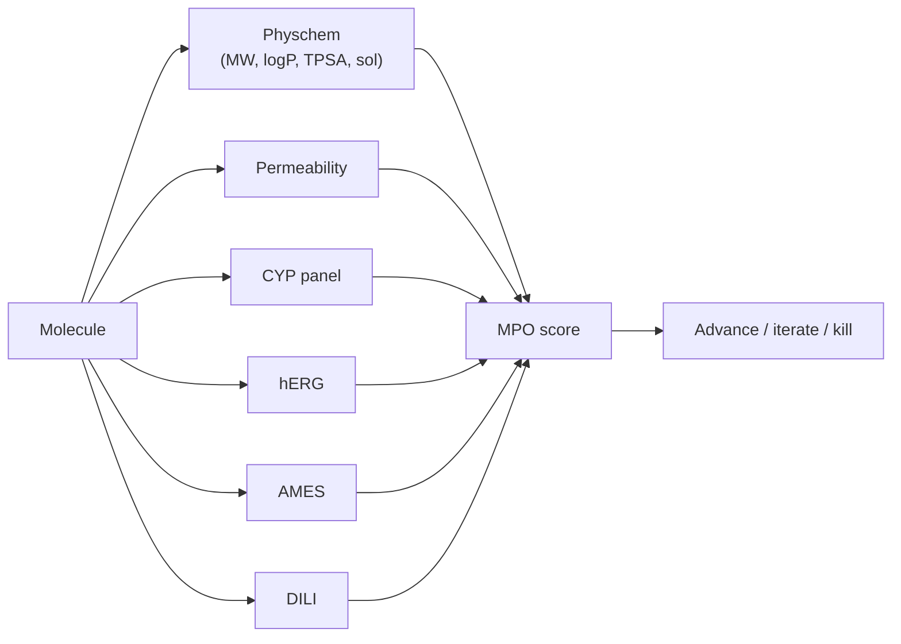

# ADMET & toxicity

> Absorption, distribution, metabolism, excretion, toxicity. The properties that kill drug programs after they are potent.

A pre-clinical compound with single-digit-nanomolar potency but a 200-nM hERG IC50, a 30-minute half-life in human liver microsomes, and Ames-positive metabolites is not a drug candidate. The ADMET chapter sets are about predicting these properties early enough that the chemistry team can iterate, not at the end where it is too late.

## Chapters

- **[Absorption](absorption.md)** — solubility, permeability, oral bioavailability.
- **[Distribution](distribution.md)** — plasma-protein binding, volume of distribution, tissue partitioning.
- **[Metabolism](metabolism.md)** — CYP-mediated and phase II metabolism; metabolite identification.
- **[Excretion](excretion.md)** — renal and biliary clearance.
- **[In-silico toxicity](toxicity.md)** — hERG, hepatotoxicity, mutagenicity, carcinogenicity, the standard panels.
- **[Safety pharmacology](safety.md)** — secondary pharmacology, off-target screening, CNS / CV pharmacology.
- **[Blood–brain barrier](bbb.md)** — the CNS-specific distribution problem.

## What computation contributes

| Property | In-silico maturity (2025) |
| --- | --- |
| Solubility (LogS) | mature, ~0.6 log RMSE |
| Permeability (PAMPA / Caco-2) | mature, AUROC ~0.8 |
| Plasma-protein binding | usable, ~0.4 log RMSE on fu |
| Microsomal clearance | usable, AUROC ~0.75 for "stable / unstable" |
| CYP inhibition (3A4, 2D6, 2C9, 1A2) | mature, AUROC ~0.85 |
| hERG inhibition | mature, AUROC ~0.85 |
| AMES mutagenicity | mature, AUROC ~0.85 |
| Hepatotoxicity (DILI) | usable, AUROC ~0.75 |
| BBB penetration | mature, AUROC ~0.8 |
| Carcinogenicity | weak |
| Idiosyncratic toxicity | very weak |

Public benchmark resources (Therapeutics Data Commons, MoleculeNet, ADMET-AI) make most of the "mature" categories essentially commodity. The hard categories remain hard.

## The ADMET screening playbook

A modern small-molecule program runs an **ADMET predictor cascade** at every compound-design stage:

Each predictor outputs a number and an uncertainty. Compounds with hard-fail predictions (hERG IC50 < 1 µM, AMES probability > 0.6) get triaged out automatically; borderline calls go to chemist review.

## The TDC benchmarks

The [Therapeutics Data Commons](https://tdcommons.ai) (TDC) is the canonical public benchmark for ADMET. Its 22 ADMET tasks span all of A, D, M, E, T and are scaffold-split by default. A new model that does not report on TDC is not comparable to the literature.

## ADMET-AI

[Swanson et al., 2023](https://doi.org/10.1093/bioinformatics/btae416)[^admetai] — a Chemprop-based predictor for the full TDC ADMET panel, with a free web service and Python interface. The right thing to install for "give me a fast number on a fast time-scale" ADMET prediction.

## What in-silico does not (yet) replace

- **Carcinogenicity studies** — 2-year rodent, no good in-silico replacement.
- **Reproductive / developmental tox** — partial coverage at best.
- **Idiosyncratic hepatotoxicity** — DILI predictors flag *some* mechanisms; not all.
- **Immunogenicity for biologics** — multiple methods exist, all imperfect.
- **Drug-drug interaction risk in real patients** — predictable in vitro, not always in vivo.

When ML predictors say "looks fine" but the wet ADMET later says otherwise, the wet result wins. ML is a *triage* tool, not the verdict.

## In practice

- **Run the full ADMET panel on every advanced compound**, virtual or real. ADMET-AI on a CSV is a 5-minute job.
- **Include ADMET predictions in MPO**. Optimising potency-only produces "candidates" that fail downstream.
- **Calibrate ADMET predictors on in-house data** when you have it. Public benchmarks transfer imperfectly to assay panels with different operating definitions.

## References

[^admetai]: Swanson K, Walther P, Leitz J, et al. ADMET-AI: a machine learning ADMET platform for evaluation of large-scale chemical libraries. *Bioinformatics.* 2024;40(7):btae416. [doi:10.1093/bioinformatics/btae416](https://doi.org/10.1093/bioinformatics/btae416)
