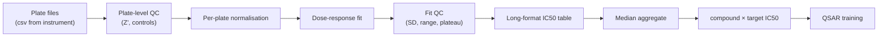

# Assay data pipelines

> Internal HTS, dose-response, and panel data. Where most real-world data engineering pain lives.

## What makes assay data hard

- **Replicates** — multiple wells per compound, sometimes across plates.
- **Controls** — positive / negative / vehicle / DMSO; used to normalise.
- **Plate effects** — edge / row / column biases; plate-to-plate variability.
- **Censored data** — IC50 > 10 µM when the assay only goes that high.
- **Dose-response curves** — IC50 = parameter of a fitted curve, not a single measurement.
- **Versioning** — assay protocols evolve; the v1 IC50 is not the v2 IC50.

A pipeline that ignores any of these produces silently wrong data.

## Single-dose HTS

The simplest form. Each compound is tested at one concentration. The output: "% inhibition relative to control".

Normalisation:

\[
\%inh = 100 \cdot \frac{S_{ctrl-} - S_{compound}}{S_{ctrl-} - S_{ctrl+}}
\]

where \(S_{ctrl-}\) is the no-inhibitor control and \(S_{ctrl+}\) is the maximal-inhibition control. **Always normalise per plate**, not across plates.

**Z' factor** is the canonical plate-quality metric [Zhang et al., 1999](https://doi.org/10.1177/108705719900400206)[^zprime]:

\[
Z' = 1 - \frac{3(\sigma_{+} + \sigma_{-})}{|\mu_{+} - \mu_{-}|}
\]

Z' > 0.5 is excellent; 0.4–0.5 acceptable; below 0.4 throw out the plate or flag for review.

## Dose-response

Multiple concentrations per compound. Fit a 4-parameter Hill equation:

\[
\%inh = \text{Bottom} + \frac{\text{Top} - \text{Bottom}}{1 + (IC_{50} / [I])^n}
\]

IC50 is one of four fitted parameters. A clean fit needs:

- ≥ 6 concentration points spanning at least 3 log units of concentration.
- Inflection point captured within the measured range.
- Goodness of fit (residual SD, parameter SD) below thresholds.

A naive "report IC50 from the curve fit" pipeline produces nonsense values for compounds with insufficient concentration range. Quality-gate every IC50 before it goes to downstream tables.

## Replicate aggregation

Multiple plates × multiple wells per compound. Two approaches:

1. **Per-experiment IC50 fitted from all wells, one IC50 per (compound, target, occasion)**.
2. **Aggregate IC50s across occasions** by median, reporting n and dispersion.

Use approach (1) per measurement; (2) for the table downstream consumers use. Carry the underlying measurements (long format) so re-aggregation is possible.

## Censored data

When the assay range cuts off the curve:

- A compound active beyond the highest dose → IC50 < lowest IC50 measurable.
- A compound inactive at the highest dose → IC50 > highest dose tested.

Drop censored data → biased estimate. Treat as `<` or `>` and use proper censored-regression in QSAR training. The `lifelines` package and survival-analysis methods translate directly.

## Plate effects

Edge effects (evaporation), row/column biases (pipetting), per-plate scaling.

Normalisations:

- **B-score** [Brideau et al., 2003](https://doi.org/10.1177/1087057103258285)[^bscore] — median-polish row/column removal.
- **NPI (normalised percentage inhibition)** — control-normalised.
- **Median subtraction** within plate.

Use the simplest that works for your assay; don't overfit normalisation when biology is the limiting factor.

## Versioning

Assay protocols evolve. The v1 IC50 (substrate concentration A, ATP concentration B) is not the v2 IC50 (substrate C, ATP D). Treat them as **different assays** in the schema:

| assay_id | assay_version | description |
| --- | --- | --- |
| KIN1 | v1 | substrate A, ATP B |
| KIN1 | v2 | substrate C, ATP D |

Build the QSAR per (assay_id, assay_version) unless you have explicit cross-version calibration.

## Pipeline shape

Each step is independently testable; failures at one stage are flagged early, not silently propagated.

## In practice

- **Plate-level QC before normalisation; fit-level QC before aggregation.** Two gates, in that order.
- **Long format is the source of truth.** Wide-format compound×target tables are derived views.
- **Treat censored data as censored.** Drop-or-impute is wrong.
- **Version assays explicitly.** "Same name, different protocol" is the cause of half the cross-team analytics arguments.

## References

[^zprime]: Zhang JH, Chung TDY, Oldenburg KR. A simple statistical parameter for use in evaluation and validation of high-throughput screening assays. *J Biomol Screen.* 1999;4(2):67–73. [doi:10.1177/108705719900400206](https://doi.org/10.1177/108705719900400206)
[^bscore]: Brideau C, Gunter B, Pikounis B, Liaw A. Improved statistical methods for hit selection in high-throughput screening. *J Biomol Screen.* 2003;8(6):634–647. [doi:10.1177/1087057103258285](https://doi.org/10.1177/1087057103258285)

## Where to next

[Lakehouse for chemistry & biology](lakehouse.md) — file formats and partitioning at scale.
