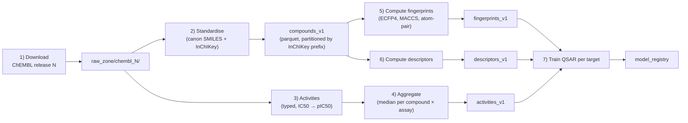

# Cheminformatics pipelines

> A worked example: ingesting ChEMBL, standardising compounds, computing features, publishing to a lakehouse.

The narrative below is the kind of pipeline you would build for any small-molecule discovery team. The details are intentionally specific — vague templates are useless.

## The pipeline



## Step 1 — download

ChEMBL releases are versioned (e.g. `chembl_34`). Download the SQLite or Postgres dump; do not scrape the API for bulk loads.

```bash
wget https://ftp.ebi.ac.uk/pub/databases/chembl/ChEMBLdb/releases/chembl_34/chembl_34_postgresql.tar.gz
tar xzf chembl_34_postgresql.tar.gz
```

Write to `raw_zone/chembl_34/` — immutable. Never re-download to the same path on a re-run.

## Step 2 — standardise

The compounds table arrives with a `chembl_id` and a `canonical_smiles`. ChEMBL's canonical SMILES are not RDKit-canonical, and tautomer choices vary. The standardisation step:

```python
from rdkit import Chem
from rdkit.Chem.MolStandardize import rdMolStandardize

def standardise(smiles_in: str) -> dict | None:
    mol = Chem.MolFromSmiles(smiles_in)
    if mol is None:
        return None
    mol = rdMolStandardize.Cleanup(mol)
    mol = rdMolStandardize.ChargeParent(mol)
    mol = rdMolStandardize.TautomerEnumerator().Canonicalize(mol)
    return {
        "smiles_input":  smiles_in,
        "smiles_canon":  Chem.MolToSmiles(mol),
        "inchikey":      Chem.MolToInchiKey(mol),
        "mw":            float(Chem.Descriptors.MolWt(mol)),
        "n_heavy":       int(mol.GetNumHeavyAtoms()),
    }
```

Output table: `compounds_v1.parquet` with columns above. Deduplicate on InChIKey. Log compound-loss rate (typically 0.1–0.5% for ChEMBL inputs).

## Step 3 — activities

ChEMBL's `activities` table holds the bioactivity measurements. The schema is rich; the pipeline keeps:

| Column | Source |
| --- | --- |
| chembl_id | activities.molregno → molecule_dictionary |
| target_chembl_id | target_dictionary |
| standard_type | "IC50", "Ki", "Kd", "EC50" |
| standard_value | numeric |
| standard_units | "nM", "µM", "M" |
| standard_relation | "=", "<", ">" |
| pchembl_value | already-computed −log10(value in M) when available |
| assay_chembl_id | assay_dictionary |
| activity_comment | freetext |
| document_chembl_id | document_dictionary (the paper) |

Convert all to a canonical `value_nM` and a `pIC50` (or `pAct`) and keep both:

```python
def to_nm(value, units):
    if units == "nM": return value
    if units == "uM": return value * 1000
    if units == "M":  return value * 1e9
    return None

df = df.with_columns(
    value_nM=pl.struct(["standard_value", "standard_units"]).map_elements(
        lambda r: to_nm(r["standard_value"], r["standard_units"])
    ),
    pAct=-pl.col("value_nM").log10() + 9.0,  # nM → M and -log10
)
```

## Step 4 — aggregate

Multiple measurements per (compound, target) are common. Aggregate carefully:

```python
agg = (
    df.filter(pl.col("standard_relation") == "=")  # drop censored for the simple median
      .group_by(["inchikey", "target_chembl_id"])
      .agg([
          pl.col("pAct").median().alias("pAct_median"),
          pl.col("pAct").std().alias("pAct_sd"),
          pl.col("pAct").count().alias("n_replicates"),
          pl.col("document_chembl_id").n_unique().alias("n_sources"),
      ])
)
```

Use the *median*; log the std; carry replicate counts.

## Step 5 — fingerprints

For 2M ChEMBL compounds, compute Morgan radius-2 2048-bit fingerprints once and store as int8 arrays.

```python
import polars as pl
import numpy as np
from rdkit import Chem
from rdkit.Chem import rdFingerprintGenerator

gen = rdFingerprintGenerator.GetMorganGenerator(radius=2, fpSize=2048)

def fp_bits(smi):
    mol = Chem.MolFromSmiles(smi)
    return np.zeros(2048, dtype=np.uint8) if mol is None else np.array(gen.GetFingerprint(mol), dtype=np.uint8)

fps = np.stack([fp_bits(s) for s in compounds["smiles_canon"]])
np.save("fingerprints_v1/morgan_r2_2048.npy", fps)
# index for matching InChIKey → row
compounds["fp_row"] = np.arange(len(compounds))
```

For ultra-fast similarity search, persist as `FPSim2` index or chemfp database.

## Step 6 — descriptors

A flat parquet of ~30 RDKit descriptors per compound, joinable by InChIKey.

## Step 7 — QSAR per target

For each target with ≥ 50 measurements, fit a baseline RF (and optionally Chemprop) and register the model.

```python
from sklearn.ensemble import RandomForestRegressor
import joblib

for target in active_targets:
    sub = activities[activities.target_chembl_id == target]
    sub = sub.join(compounds[["inchikey","fp_row"]], on="inchikey")
    X = fps[sub.fp_row.to_numpy()]
    y = sub.pAct_median.to_numpy()
    if len(y) < 50:
        continue
    model = RandomForestRegressor(n_estimators=500, n_jobs=-1, random_state=0).fit(X, y)
    joblib.dump(model, f"model_registry/qsar_{target}.joblib")
```

## What this gives you

- A canonical compound table joinable on InChIKey.
- A canonical activity table per (compound, target).
- Pre-computed features for fast ML iteration.
- A QSAR model per target ready to score new molecules.

The pipeline above, written carefully, is ~500 lines of Python. It is the substrate every drug-discovery team rebuilds anyway; build it well once.

## Where to next

[Assay data pipelines](assay-data.md) — internal assay workflows where things get messier.
