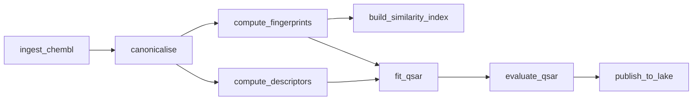

# The DAG mental model

> Every pipeline is a directed acyclic graph of tasks. Once you internalise that, half of the tooling questions vanish.

## Why DAGs

A pipeline has:

- **Tasks** — discrete units of computation (canonicalise SMILES, fit fingerprints, train model).
- **Dependencies** — task B reads task A's output.
- **A schedule** — tasks run when their dependencies are fresh and their inputs available.

That structure is a **directed acyclic graph**. Once you draw it, scheduling, retries, and observability become mechanical.

Each node is independently testable, retriable, and cacheable.

## The orchestrators

| Orchestrator | Best for | Notes |
| --- | --- | --- |
| **Airflow** | classic, mature | the industrial default for years |
| **Prefect** | newer, Pythonic | nice for hybrid local/cloud |
| **Dagster** | typed, asset-centric | strong for ML / data-asset thinking |
| **Snakemake** | bioinformatics / HPC | the right tool on a cluster |
| **Nextflow** | bioinformatics, multi-language | dominant in genomics |
| **Make / Justfile** | small projects | the bar |

For drug-discovery industry pipelines, Airflow / Prefect / Dagster dominate. For academic / HPC, Snakemake or Nextflow. For tutorial-scale work, a Makefile or a Python script with explicit `if not output.exists()` guards is enough.

## Local development

A DAG should be **runnable end-to-end on a developer's laptop** with a downsampled dataset. If it is not, debugging becomes pager-duty work.

The pattern: every task takes an input directory and a configuration; tasks chain by reading the previous output. Tools like `kedro`, `dagster`, and `dlt` formalise this.

## Backfilling

When a bug is found in step 3, you need to re-run steps 3 onward for all historical partitions. The DAG model makes this clean:

- Identify the affected node and its descendants.
- For each partition (date / version), schedule the re-run.
- The orchestrator handles parallelism and retries.

A pipeline whose author cannot answer "how would you backfill all of last quarter?" is incomplete.

## Task granularity

Too coarse: failures take down hours of work; reruns are wasteful.

Too fine: orchestrator overhead dominates; debugging is harder.

A workable rule: **a task should be 1–60 minutes** of work, with clear input and output. "Ingest ChEMBL release X" is one task. "Compute Morgan fingerprints for all ChEMBL X compounds" is one task. "Run QSAR for kinase Y on ChEMBL X" is one task.

## Data assets

The Dagster / modern abstraction: think in **assets** (the data produced) rather than **tasks** (the operations). An asset is uniquely identified, has a known lineage, and is automatically scheduled when its inputs change.

For drug discovery, where reproducibility and lineage matter, the asset abstraction is a strong fit.

## In practice

- **Draw the DAG before writing it.** A 10-line YAML or Mermaid diagram catches problems early.
- **Choose orchestrator by team and scale**, not by Twitter hype. Airflow at scale, Snakemake on HPC, a Makefile if you're alone.
- **Make every task locally runnable** with a small fixture dataset.
- **Backfilling is a first-class operation**, not an afterthought.

## Where to next

[The five pillars](five-pillars.md) — what to monitor in a running DAG.
