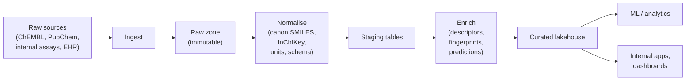

# Foundations

> What every drug-discovery data pipeline must do, regardless of scale.

## The pipeline shape



Every pipeline has the same four moves: ingest, normalise, enrich, serve. The discipline is in the boundaries between them.

## The five non-negotiables

1. **Idempotency** — re-running a step with the same input produces the same output.
2. **Immutable raw zone** — never overwrite raw data; new versions go to new partitions.
3. **Schema validation at every boundary** — typed contracts on each table.
4. **Provenance metadata** — `source`, `version`, `ingested_at` on every row.
5. **Observability** — every step logs row counts, schema, and key health metrics.

If you skip any of these, you will rebuild them later, after a bug bites.

## Compound identity, one more time

The most common drug-discovery data bug. The rules:

- **Always canonicalise SMILES** with one canonical procedure (e.g. RDKit MolStandardize + Chem.MolToSmiles).
- **Always carry the original SMILES** alongside the canonical, for traceability.
- **Always compute InChIKey** and use it as the join key.
- **Always check for and log tautomers, stereo loss, and salt fragments** during ingestion.

A `standardise_compounds.py` module is the right shape; one entry-point function called from every ingestion path.

## Time-aware assay data

Activity tables grow over time. The schema should be **append-only**:

| Column | Why |
| --- | --- |
| compound_id | foreign key to compound table |
| assay_id | which assay |
| value, value_units | the measurement |
| operator | "=", "<", ">" (censored data) |
| replicate_id | within-plate replicate |
| plate_id, well_id | for plate / position analysis |
| measured_at | timestamp |
| operator_name, instrument | provenance |
| source_version | raw-data version |
| ingested_at | when this row was added |

Read paths aggregate (median per compound per assay, with N counted). Write paths only append. Never overwrite a row.

## Idempotency in practice

Hard rules:

- **Output partitions named by content hash or version tag.** Re-running writes to a new partition.
- **Skip-if-exists** — every step checks for its output before running.
- **No mutable state** between runs (except a log).

This is how a pipeline becomes safe to re-run on a hour-of-the-night pager:

```python
def step(in_path, out_path, version):
    out = Path(out_path) / f"v={version}"
    if out.exists():
        return out
    df = run_transform(load(in_path))
    out.mkdir(parents=True, exist_ok=False)
    df.write_parquet(out / "data.parquet")
    return out
```

## Observability

Each step logs:

- **Row counts** in and out.
- **Schema fingerprint** of the output.
- **Null-rate per column**.
- **Domain-specific health metrics** (e.g. "% rows where canonical SMILES differed from input").
- **Run timestamp, source version, code version**.

A pipeline whose logs cannot answer "did the last run process all of yesterday's compounds?" is not observable.

## In practice

Build pipelines that survive 3 a.m. on-call. Idempotent, observable, append-only, schema-validated. The rest is decoration.

## Where to next

[The DAG mental model](dag.md) — pipelines as graphs.
