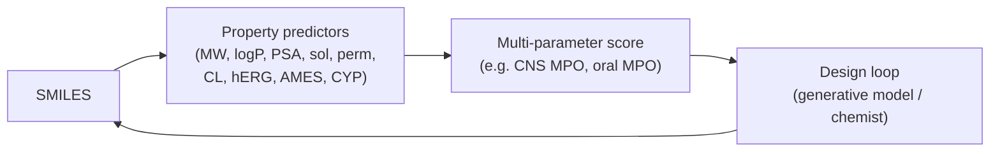

# ADMET overview

> The five letters that kill more drug programs than potency. A short conceptual pass — deep dives in [ADMET & toxicity](../admet-tox/index.md).

ADMET = Absorption, Distribution, Metabolism, Excretion, Toxicity. A drug failing on any one of them will not become a medicine.

Industry data attributes roughly **30 % of clinical failures** to ADMET / pharmacokinetic problems, on top of separately-attributed toxicity failures [Kola & Landis, 2004](https://doi.org/10.1038/nrd1470)[^kola].

## A — Absorption

Will the drug get into the body when dosed?

- **Oral** is the goal where possible. Requires solubility *and* permeability across the intestinal epithelium.
- **Caco-2 / PAMPA** assays are the in-vitro proxies for intestinal permeability; computational predictors target log P_eff.
- **Solubility** depends on lattice energy and solvation; many failed compounds are too crystalline.
- **First-pass metabolism** in the gut wall and liver cuts oral bioavailability — sometimes catastrophically.

Designer levers: reduce HBD count, keep cLogP in 1–4 range, control polar surface area (< 140 Ų for oral, < 90 Ų for CNS).

## D — Distribution

Where does the drug go after entering circulation?

- **Plasma-protein binding** (PPB) often reaches 95–99 %. Only the unbound fraction is pharmacologically active.
- **Volume of distribution** (V_d) tells you tissue partitioning. Small (< 0.2 L/kg): plasma-confined. Large (> 5 L/kg): heavily tissue-bound.
- **Tissue barriers** — most importantly the **blood–brain barrier** (BBB). P-glycoprotein (P-gp) efflux is the dominant CNS-distribution obstacle.

Designer levers: lipophilicity tune (logP / D), basicity reduction for CNS, reduce P-gp substrate liability.

## M — Metabolism

Mostly hepatic. Mostly cytochrome P450s.

- **CYP3A4** metabolises ~50% of marketed drugs; **CYP2D6**, **CYP2C9**, **CYP1A2** cover most of the rest.
- **Phase II** (glucuronidation, sulfation, glutathione conjugation) is rarer to model but important for some scaffolds.
- **Two failure modes**: (1) the drug is metabolised too fast → no exposure; (2) the drug *inhibits* a CYP → drug–drug interactions.
- **Reactive metabolites** can drive idiosyncratic toxicity (aniline, furan, thiazolidinedione liabilities).

Designer levers: block metabolic soft spots (deuteration, –CF₃, ortho substitution), avoid known toxicophores, balance against logP.

## E — Excretion

- **Renal** — small, polar molecules cleared via the kidney.
- **Biliary** — larger, lipophilic molecules secreted in bile.
- **Metabolites** as well as parent are eliminated; their disposition matters too.
- The **fraction excreted unchanged (f_e)** distinguishes "renally cleared" (statins are not; PCSK9 mAbs are not; metformin is) from "hepatically cleared" drugs — the former are sensitive to renal impairment.

## T — Toxicity

The catch-all. The major buckets:

- **Cardiotoxicity** — hERG channel block → QT prolongation → torsade. Routine flag.
- **Hepatotoxicity** — bile-salt export pump inhibition, reactive metabolites, mitochondrial dysfunction.
- **Mutagenicity / genotoxicity** — Ames test, micronucleus test, ICH M7.
- **Carcinogenicity** — 2-year rodent studies.
- **Reproductive / developmental** toxicity.
- **Immunotoxicity** — immunosuppression, cytokine storm risk.
- **Tissue-specific** — kidney, lung, skin, retinal, ototoxicity.
- **Phototoxicity** — skin reactivity in the presence of UV.

Computationally, the highest-value early predictors are **hERG**, **AMES mutagenicity**, **CYP inhibition**, and **hepatotoxicity classification**. Modern models (ADMET-AI, ChemProp-derived) reach respectable AUROCs on public benchmarks but are not regulatory replacements — they exist to *prioritise* compounds.

## The integrated picture

The ADMET problem is one of **multi-property co-optimisation**:

This is the heart of [MPO (multi-parameter optimisation)](../molecular-design/mpo.md). No single property defines a drug. The art is the trade-off.

## In practice

- **Predict ADMET early**, even on virtual molecules. A computationally-cheap reject is better than a synthesised reject.
- **Model uncertainty matters more than absolute accuracy** for filtering: a calibrated probability of being a hERG hitter is more useful than a hard binary label.
- **Always include experimental ADMET in the same dataset as activity**. Otherwise you optimise potency and pay for it in tox.

## References

[^kola]: Kola I, Landis J. Can the pharmaceutical industry reduce attrition rates? *Nat Rev Drug Discov.* 2004;3(8):711–715. [doi:10.1038/nrd1470](https://doi.org/10.1038/nrd1470)

## Where to next

[Drug-discovery pipeline](pipeline.md) — the end-to-end map of where computation slots into the development chain.
