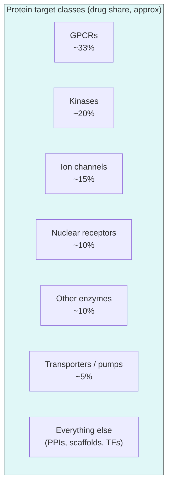

# Biological targets

> The biological entities a drug acts on. Why some are tractable and others are not.

A **target** is the biological object whose modulation produces the therapeutic effect. Most of the time it is a protein. Sometimes it is RNA, DNA, a lipid, a glycan, or a whole cell. The choice of target is the single highest-leverage decision in a drug-discovery program — by the time you are deep into chemistry, the target is essentially fixed.

## The major protein target classes

*<small>Approval-share-by-class is a useful prior, not a destiny — see [Santos et al., 2017](https://doi.org/10.1038/nrd.2016.230)[^santos].</small>*

### G-protein–coupled receptors (GPCRs)

Seven-transmembrane proteins that transduce extracellular signals (hormones, neurotransmitters, odorants, light) to intracellular G-protein and β-arrestin cascades.

- **Subfamilies**: class A (rhodopsin-like, the biggest), B (secretin-like), C (glutamate-like), F (frizzled).
- **Why historically tractable**: well-defined orthosteric pocket; rich pharmacology; many endogenous ligands.
- **Recent shift**: biased agonism (signalling pathway preference), allosteric modulation, structure-based design enabled by cryo-EM.
- **Examples**: β-blockers (β1 adrenergic receptor), antipsychotics (D2), GLP-1R agonists (semaglutide, tirzepatide).

### Kinases

Enzymes that transfer phosphate groups from ATP to substrate proteins. The human kinome has ~520 kinases [Manning et al., 2002](https://doi.org/10.1126/science.1075762)[^kinome].

- **Pocket**: ATP-binding site (type I/II), allosteric (type III), covalent (type VI).
- **Why historically tractable**: druggable pocket, abundant SAR (≥ 80 approved kinase inhibitors), clear oncology use cases.
- **Challenge**: selectivity across a paralog family of 520 kinases. Most "selective" kinase inhibitors hit a handful.
- **Examples**: imatinib (BCR-ABL), erlotinib (EGFR), ibrutinib (BTK), trametinib (MEK1/2).

### Ion channels

Membrane proteins that allow selective ion flow (Na⁺, K⁺, Ca²⁺, Cl⁻).

- **Mechanism**: voltage-gated, ligand-gated, mechanically gated.
- **Examples**: local anaesthetics (Na_V), benzodiazepines (GABA_A), gabapentin (Ca_V α2δ), amlodipine (Ca_V).
- **Imaging / electrophysiology** is the wet-lab assay; computational support is mostly homology modelling, MD of pore dynamics, and on/off rate prediction.

### Nuclear receptors

Ligand-activated transcription factors (oestrogen, androgen, glucocorticoid, vitamin D, PPAR families).

- **Examples**: tamoxifen (ER), enzalutamide (AR), dexamethasone (GR), GLP-1 / PPARγ in metabolic disease.

### Other enzymes

Proteases, phosphatases, oxidoreductases, transferases, hydrolases. Statin targets (HMGCR), thrombin, COX-1/2, aromatase, DNA topoisomerases, dihydrofolate reductase.

### Transporters and pumps

SLC and ABC families. SGLT2 (diabetes), DAT/NET/SERT (CNS), proton pump (PPI gastroenterology drugs).

### "Undruggable" classes (which keep becoming druggable)

- **Transcription factors** (MYC, p53, RAS). For years considered undruggable because they lack deep pockets. Now: covalent KRAS inhibitors (sotorasib), MYC degraders, BET-bromodomain inhibitors.
- **Protein–protein interfaces** (BCL-2 / BAX, MDM2 / p53). Flat, shallow, hard. Venetoclax (BCL-2) and nutlins (MDM2) are the proof points.
- **Scaffolding proteins** with no enzymatic function — historically degrader territory.

## Druggability — the deciding question

A target is **druggable** if a tractable molecule can be designed that engages it sufficiently to produce a therapeutic effect at safe doses.

Druggability decomposes into:

1. **Tractability** — does the target have a binding pocket a small molecule can occupy? (Or, in the biologic / oligo case, is it accessible to that modality?)
2. **Disease linkage** — is modulating the target actually predicted to change the disease?
3. **Therapeutic window** — can the effect be achieved without intolerable on- or off-target tox?
4. **IP and competitive landscape** — even if all three above are true, is there headroom?

A tractable target with weak disease linkage is the most common silent failure. A drug that binds beautifully but does not help patients was never going to.

## Tractability — what does a "druggable pocket" look like?

For small molecules, a tractable pocket typically:

- Has a volume of ~300–1000 ų.
- Is enclosed (high "buriedness"), not a flat surface.
- Has a mix of hydrophobic, polar, and (ideally) charged hot spots.
- Is dynamic enough that an inhibitor can fit but rigid enough that affinity is achievable.

Tools that score pocket druggability:

- **FPocket** [Le Guilloux et al., 2009](https://doi.org/10.1186/1471-2105-10-168)[^fpocket] — geometric pocket detection, free.
- **DoGSiteScorer** — geometric + chemical features, web service.
- **SiteMap** (Schrödinger) — DScore for druggability.
- **DeepPocket**, **P2Rank** — ML pocket prediction (P2Rank is open-source and surprisingly strong).

## Validation — does modulating it actually help?

Tractability is necessary but not sufficient. **Target validation** is a separate question.

Levels of evidence, from cheap to expensive:

1. **Genetic association** — GWAS, exome sequencing, loss-of-function carriers (e.g. PCSK9 inactivating mutations → low LDL → eventual statins).
2. **Mendelian randomisation** — a causality-leaning analysis of genetic variants.
3. **Tool compounds in vitro** — chemical probes (KAT, PROBES, [SGC chemical probes](https://www.thesgc.org/chemical-probes)).
4. **Tool compounds / genetic perturbation in vivo** — knock-out / knock-in / conditional alleles in mouse.
5. **Patient data** — biopsy expression, single-cell profiling.
6. **A drug already does it** — drug repurposing or "known-target, new-indication" plays.

By time tractability and validation both clear, the program is no longer at "target ID" — it is at hit ID.

## In practice

- The **Open Targets Platform** ([Ochoa et al., 2021](https://doi.org/10.1093/nar/gkaa1027)[^opentargets]) is the right starting point for any target-discovery question. Aggregates genetics, drugs, expression, and literature evidence in one schema.
- The **canSAR Knowledgebase** ([Mitsopoulos et al., 2021](https://doi.org/10.1093/nar/gkaa1059)[^cansar]) adds chemistry-aware tractability.
- For protein-level tractability, run **FPocket** / **P2Rank** on the structure (AlphaFold prediction is good enough) and read the output as a *prior*, not a verdict.
- Never advance a target on tractability alone. The cheapest way to kill a target is to find out *post-clinical* that modulating it does nothing.

## References

[^santos]: Santos R, Ursu O, Gaulton A, et al. A comprehensive map of molecular drug targets. *Nat Rev Drug Discov.* 2017;16(1):19–34. [doi:10.1038/nrd.2016.230](https://doi.org/10.1038/nrd.2016.230)
[^kinome]: Manning G, Whyte DB, Martinez R, Hunter T, Sudarsanam S. The protein kinase complement of the human genome. *Science.* 2002;298(5600):1912–1934. [doi:10.1126/science.1075762](https://doi.org/10.1126/science.1075762)
[^fpocket]: Le Guilloux V, Schmidtke P, Tuffery P. Fpocket: an open source platform for ligand pocket detection. *BMC Bioinformatics.* 2009;10:168. [doi:10.1186/1471-2105-10-168](https://doi.org/10.1186/1471-2105-10-168)
[^opentargets]: Ochoa D, Hercules A, Carmona M, et al. Open Targets Platform: supporting systematic drug-target identification and prioritisation. *Nucleic Acids Res.* 2021;49(D1):D1302–D1310. [doi:10.1093/nar/gkaa1027](https://doi.org/10.1093/nar/gkaa1027)
[^cansar]: Mitsopoulos C, Di Micco P, Fernandez EV, et al. canSAR: update to the cancer translational research and drug discovery knowledgebase. *Nucleic Acids Res.* 2021;49(D1):D1074–D1082. [doi:10.1093/nar/gkaa1059](https://doi.org/10.1093/nar/gkaa1059)

## Where to next

[Disease biology](disease-biology.md) — how a disease becomes a target, the major therapeutic areas, what drives industry spend.
