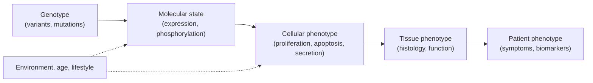
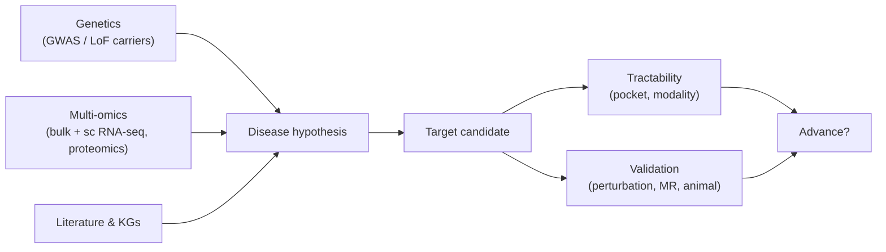

# Disease biology

> How diseases become drug-discovery problems. The big therapeutic areas and what their tractability looks like.

A drug program does not start with chemistry — it starts with a disease and a hypothesis about what is going wrong biologically. This page is a compact tour of the major therapeutic areas, the mechanisms that dominate them, and the computational data sources you will meet in each.

## Disease as a network failure

Most diseases are not single-protein-fail-and-everything-stops scenarios. They are failures of biological **networks**: signalling pathways, gene-expression programmes, immune cell-state transitions. A useful mental model:

*<small>Disease cascade. The target a drug engages is somewhere in the middle; the endpoint a trial reads out is at the right.</small>*

Most computational target ID lives in the *Molecular → Cellular* slice. Most clinical translation work lives in *Cellular → Patient*.

## The big therapeutic areas

### Oncology

About half of industry pipeline value, by some measures.

- **Mechanisms**: oncogene activation (KRAS, MYC, RAF/MEK), tumour-suppressor loss (p53, RB, PTEN), DNA-repair defects (BRCA1/2, MMR), immune evasion (PD-L1, IDO, TIGIT).
- **Modalities**: kinase inhibitors, ADCs, immune-checkpoint mAbs, bispecifics, cell therapy, cancer vaccines, PROTACs.
- **Data**: TCGA, ICGC, CCLE, DepMap (genome-wide CRISPR essentiality across cell lines), Genomics of Drug Sensitivity in Cancer (GDSC).
- **Computational angles**: synthetic lethality discovery, neoantigen prediction, tumour heterogeneity modelling, response prediction from genomics.

### Neurology / neurodegeneration

Alzheimer's, Parkinson's, Huntington's, ALS, multiple sclerosis, frontotemporal dementia.

- **Mechanisms**: protein aggregation (amyloid-β, tau, α-synuclein, TDP-43, huntingtin), synaptic dysfunction, neuroinflammation, demyelination, mitochondrial failure.
- **Modalities**: small molecules (notoriously hard for CNS), mAbs (lecanemab, aducanumab, ocrelizumab), ASOs (tofersen for SOD1-ALS, nusinersen for SMA), gene therapy.
- **Data**: ADNI, UK Biobank brain MRI / imaging genetics, AMP-AD, ROSMAP, Allen Brain Atlas, single-cell atlases.
- **Computational angles**: imaging-genetics, MR / PET biomarkers, protein-language-model studies of aggregation prone sequences, **see also [NeuroStack](https://github.com/phindagijimana/neuro_stack)**.

### Infectious disease

Bacterial, viral, fungal, parasitic.

- **Mechanisms**: pathogen-specific enzymes (HIV protease, HCV NS5B, SARS-CoV-2 Mpro), host factors (CCR5, ACE2), antimicrobial resistance.
- **Modalities**: small molecules, vaccines, mAbs, antimicrobial peptides, phage therapy.
- **Data**: ChEMBL antimicrobial subset, the ATLAS antimicrobial surveillance database, GenBank, BV-BRC.
- **Computational angles**: resistance mutation prediction, viral evolution, structure-based antiviral design, antimicrobial peptide design.

### Immunology / inflammation

Autoimmune (RA, lupus, psoriasis, IBD), allergy, fibrosis.

- **Mechanisms**: cytokine dysregulation (TNF, IL-6, IL-17, IL-23), T-cell tolerance failure, B-cell autoreactivity.
- **Modalities**: anti-cytokine mAbs (adalimumab, secukinumab), JAK inhibitors, S1P modulators, B-cell-targeting therapies.
- **Data**: ImmGen, Human Cell Atlas immune compartments, OpenTargets autoimmune subset.

### Cardiovascular / metabolic

Atherosclerosis, heart failure, diabetes, obesity, NASH.

- **Mechanisms**: lipid metabolism (HMGCR, PCSK9), insulin / glucagon axis (GLP-1, SGLT2), thrombosis (factor Xa, P2Y12), fibrosis.
- **Modalities**: small molecules (statins, gliflozins), peptides (GLP-1 agonists), mAbs (PCSK9), siRNAs (inclisiran).
- **Data**: UK Biobank, BioBank Japan, Million Veteran Program, FOURIER, large CVOT trials.

### Rare disease

Cystic fibrosis, sickle cell, SMA, Duchenne, urea cycle defects, lysosomal storage disorders.

- **Mechanisms**: usually monogenic — one broken protein.
- **Modalities**: small molecules (ivacaftor for CFTR), ASOs, AAV gene therapy, CRISPR editing, enzyme replacement.
- **Why it matters computationally**: monogenic causation makes target ID often trivial; the hard problems are pocket / channel correctors (CFTR), gene-therapy delivery, and trial design with tiny patient populations.

## How a disease becomes a target

*<small>From disease to target. Strong genetics + multi-omics convergence is the most reliable signal.</small>*

The cleanest target stories combine:

- A **statistically robust human genetic signal** (the closer to loss-of-function, the better).
- **Concordant expression / proteomic / single-cell signals** in the disease-relevant tissue.
- A **tractable pocket or modality-compatible binding surface**.
- A **chemical probe** showing the predicted phenotype in vitro.

Programs that lack any one of these are doable but riskier; programs that lack two of these are speculative.

## In practice

- **Read the disease before reading the chemistry.** A medicinal chemist who skipped immunology will never be a credible IL-17 designer.
- **Pick a TA early in your career.** Cross-TA generalists exist but they emerge after years in one area. Drug discovery rewards depth.
- **OpenTargets, OMIM, MalaCards, DisGeNET** are your first stops for disease-gene evidence.
- **Single-cell atlases (HCA, Tabula Sapiens)** are increasingly the right "cell-of-action" reference — knowing your target is expressed in the wrong cell type can save years.

## Where to next

[Medicinal chemistry](medicinal-chemistry.md) — once a target is fixed, how chemists actually iterate on molecules.
