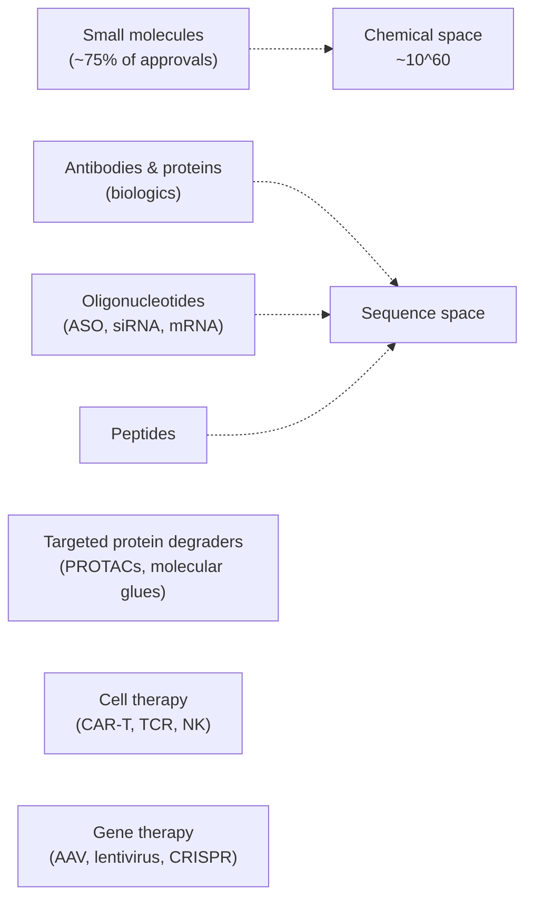

# Drug modalities

> The kinds of "drug" that exist, what each does, and what changes when you sit down at the computer.

A "drug" is not a single thing. Different modalities have different mechanisms, different developability rules, and different computational pipelines. A pharmacologist's first question is rarely "what does it do?" — it is **"what modality is it?"**.

## The big seven

*<small>Modality landscape. Approval share is approximate and shifts every year.</small>*

### 1. Small molecules

Synthetic organic compounds, typically MW < 500. Aspirin, atorvastatin, imatinib, everything most people imagine as a "pill".

- **Mechanism**: bind to a pocket on a protein and modulate its function (inhibitor, agonist, allosteric modulator, covalent warhead, etc.).
- **Administration**: usually oral.
- **Computation**: SMILES, descriptors, QSAR, docking, FEP, generative chemistry. The entire core of this handbook.
- **Failure modes**: poor solubility, poor permeability, fast metabolism, off-target tox, hERG, idiosyncratic toxicity.

### 2. Antibodies and other proteins (biologics)

Monoclonal antibodies (mAbs), bispecifics, antibody-drug conjugates (ADCs), Fc-fusions, enzymes.

- **Mechanism**: high-affinity, high-specificity binders. Block ligand-receptor interactions, mark cells for immune destruction, deliver payloads.
- **Administration**: parenteral (IV, SC). Almost never oral — they get digested.
- **Computation**: sequence-based ML, antibody-specific language models (ESM-IF, AbLang, IgLM), structure prediction (AlphaFold-multimer), developability (aggregation, viscosity, immunogenicity).
- **Failure modes**: immunogenicity, manufacturing yield, aggregation, formulation.

### 3. Peptides

Linear or cyclic peptides, ~5–50 residues. Glucagon, insulin, GLP-1 analogues, cyclosporine.

- **Mechanism**: usually mimic or block a natural protein–protein interaction.
- **Administration**: mostly injectable; some oral (with absorption enhancers) and intranasal.
- **Computation**: sequence-based, cyclisation chemistry, conformational sampling, blood-protease stability prediction.
- **Failure modes**: protease degradation, poor cell permeability, short half-life.

### 4. Oligonucleotides

Antisense oligos (ASOs), small interfering RNAs (siRNAs), mRNA therapeutics, aptamers.

- **Mechanism**: bind RNA (ASO, siRNA) or deliver protein-coding instructions (mRNA), addressing the *transcriptome* rather than the proteome.
- **Administration**: subcutaneous, intrathecal, intravitreal, IV. Lipid nanoparticle delivery for mRNA (the COVID-19 vaccine modality).
- **Computation**: sequence design, off-target risk, mRNA secondary structure, LNP formulation modelling.
- **Failure modes**: delivery, immune activation, off-target binding.

### 5. Targeted protein degraders

PROTACs (proteolysis-targeting chimeras), molecular glues, LYTACs, AUTACs.

- **Mechanism**: not inhibition — **destruction**. Recruit the cell's ubiquitin–proteasome system to ubiquitinate and degrade a target protein. A single PROTAC can degrade many copies of the target ("catalytic"), which is fundamentally different from stoichiometric inhibition.
- **Administration**: oral (where possible — these are still small molecules, just bifunctional).
- **Computation**: ternary-complex modelling, linker design, ligase-target-PROTAC docking, selectivity over the ~600 human E3 ligases.
- **Failure modes**: "hook effect" (too much PROTAC blocks ternary complex formation), tissue distribution, ligase availability.

### 6. Cell therapy

CAR-T cells, T-cell receptor (TCR) therapies, NK cells, regulatory T cells.

- **Mechanism**: engineer patient (or donor) cells ex vivo to recognise and kill disease cells, then infuse.
- **Administration**: single infusion, often after lymphodepleting chemotherapy.
- **Computation**: TCR–pMHC modelling, neoantigen prediction, CAR design, manufacturing analytics.
- **Failure modes**: cytokine release syndrome, neurotoxicity, antigen escape, T-cell exhaustion, manufacturing cost.

### 7. Gene therapy

AAV (adeno-associated virus), lentivirus, CRISPR-based editing, base editors, prime editors.

- **Mechanism**: deliver a functional gene, knock out a disease gene, or rewrite a sequence.
- **Administration**: single IV, intrathecal, intraocular, or ex vivo cell modification.
- **Computation**: guide-RNA design, off-target prediction, capsid design, delivery-tropism prediction.
- **Failure modes**: pre-existing immunity to the capsid, off-target editing, manufacturing.

## A modality comparison sheet

| Modality | Typical target | MW range | Route | Speed of action | Reversible? |
| --- | --- | --- | --- | --- | --- |
| Small molecule | Protein pocket | < 500 Da | Oral | Hours | Yes |
| Antibody | Extracellular protein | ~150 kDa | IV / SC | Days | Yes |
| Peptide | Receptor or PPI | 0.5–5 kDa | SC | Hours–days | Yes |
| ASO / siRNA | mRNA | ~7–14 kDa | SC / IT | Days–weeks | Yes (slow off-rate) |
| PROTAC | Intracellular protein | ~800–1500 Da | Oral | Hours | Yes, but "catalytic" |
| Cell therapy | Cell-surface antigen | n/a | IV | Days | Sometimes (suicide switch) |
| Gene therapy | DNA / mRNA | n/a | IV / local | Months | Often **no** |

## What changes computationally

| Question | Small molecule | Biologic | Oligo |
| --- | --- | --- | --- |
| Primary input | SMILES / graph / 3D | Amino-acid sequence (and structure) | Nucleotide sequence |
| Default ML model | GNN, transformer, GBDT on fingerprints | Protein LM (ESM), structure-aware models | Sequence transformer |
| Property prediction | logP, sol, PAMPA, hERG, CYP | Aggregation, isoelectric point, Tm | Tm, secondary structure |
| Generative method | VAE / RL / diffusion on graphs | Inverse folding, mAb-specific LMs | Constrained sequence generation |
| Structure tool | AutoDock, Glide, FEP | AlphaFold-multimer, Rosetta | RNA folding (RNAfold, AlphaFold3) |

## In practice

- **Choose modality early.** A team that picks "PROTAC" half-way through is wasting six months of small-molecule work.
- **Different modalities want different data lakes.** SMILES + assay tables for small molecule; sequence + structure for biologics; guide-RNA designs and edit outcomes for gene therapy. Do not try to fit them all into one schema.
- **The handbook focuses on small molecules and, where relevant, biologics.** Oligonucleotide, cell, and gene therapy are touched on but not exhaustively covered.

## Where to next

[Biological targets](biological-targets.md) — what these molecules actually *act on*.
