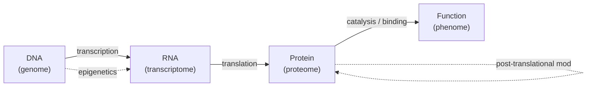

# Biology

> The central dogma, signalling, immunity, and pathways. Enough biology to read a target validation paper credibly.

The minimum biology for someone writing code about drugs.

## The central dogma

Each arrow is a regulatory layer drug discovery can act on:

- **Genome** — gene therapy, CRISPR, base / prime editing.
- **Transcriptome** — ASOs, siRNAs, mRNA therapeutics.
- **Proteome** — small molecules, antibodies, PROTACs.
- **Phenome** — cell therapy, vaccines.

The choice of regulatory layer is mostly the choice of modality.

## Cell biology essentials

- **Cells, membranes, organelles** — plasma membrane, nucleus, mitochondria, ER, Golgi, lysosomes, peroxisomes.
- **The membrane is a lipid bilayer** — why oral drugs must be lipophilic enough to cross it but polar enough to dissolve. This is the central oral-drug compromise.
- **Receptors** — most drugs act on transmembrane receptors (GPCRs, RTKs, ion channels) or intracellular receptors (nuclear receptors, enzymes).
- **Compartments** — cytosol, nucleus, organelles, extracellular space. Targets in different compartments require different modalities.

## Signalling pathways

Every drug-discovery program ends up in a pathway diagram. The frequent flyers:

- **MAPK / ERK** — RAS → RAF → MEK → ERK. Mutated in 30% of cancers.
- **PI3K / AKT / mTOR** — growth and survival signalling.
- **NF-κB** — inflammation.
- **WNT / β-catenin** — development, stem-cell biology, oncogenesis.
- **JAK / STAT** — cytokine signalling. Targeted by JAK inhibitors in RA, AD.
- **Hedgehog, Notch** — development and cancer stem cells.
- **TGF-β / SMAD** — fibrosis, immunology.

A program that "modulates ERK signalling" is making a claim that lives somewhere in this diagram. Knowing which node and why matters.

## Genetics and variants

- **Single-nucleotide variants (SNVs)**, indels, copy-number variation, structural variants.
- **Variant classes**: missense, nonsense, frameshift, splice, regulatory.
- **Loss-of-function (LoF)** variants are the strongest target-validation signal because they mimic chronic pharmacological inhibition.
- **GWAS** identifies common-variant associations; **exome / WGS** identifies rare variants.
- **Mendelian randomisation** turns a genetic association into a causality-leaning estimate.

## Immunology in three minutes

- **Innate immunity** — first responders (neutrophils, macrophages, NK cells), pattern recognition receptors (TLRs, NLRs).
- **Adaptive immunity** — B cells (antibodies), T cells (CD4 helpers, CD8 cytotoxic, regulatory).
- **MHC class I** presents intracellular peptides to CD8 cells; **MHC class II** presents extracellular peptides to CD4 cells. This is the substrate for cancer immunotherapy.
- **Cytokines** — IL-1, IL-6, IL-17, IL-23, TNF, IFN-γ. Targeted by mAbs in autoimmune disease.
- **Checkpoints** — PD-1 / PD-L1, CTLA-4, LAG-3, TIM-3, TIGIT. The substrate of modern oncology.

## Neuroscience pointer

If your target is in the CNS, much of the additional biology (BBB, glia, oligodendrocytes, neurodegeneration mechanisms, cell-type-specific expression) lives in the sibling handbook [NeuroStack](https://github.com/phindagijimana/neuro_stack). Reading both is encouraged for CNS programmes.

## Resources

- **OpenTargets** — disease-gene-drug evidence.
- **GTEx** — tissue-specific expression.
- **Human Cell Atlas / Tabula Sapiens** — single-cell expression atlases.
- **UniProt** — protein sequences and annotations.
- **KEGG, Reactome, WikiPathways** — pathway maps.
- **Ensembl, dbSNP, ClinVar, gnomAD** — variant annotation.

## Where to next

[Chemistry](chemistry.md) — the organic-and-physical-chemistry baseline.
