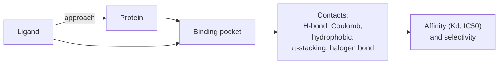

# Structural biology

> Protein structure, PDB / mmCIF, AlphaFold, Ramachandran, ligand binding. Enough to read structural-biology figures critically and run a docking calculation that means something.

## Proteins, three levels

- **Primary** — amino-acid sequence.
- **Secondary** — α-helix, β-sheet, loop. Predictable from sequence (PSI-PRED, AlphaFold).
- **Tertiary** — 3D fold of one polypeptide.
- **Quaternary** — assembly of multiple chains (homo / hetero / oligomers).

The 20 amino acids cluster into:

| Class | Residues |
| --- | --- |
| Hydrophobic | Ala, Val, Leu, Ile, Met, Phe, Trp, Pro |
| Polar uncharged | Ser, Thr, Asn, Gln, Cys, Tyr |
| Acidic | Asp, Glu |
| Basic | Lys, Arg, His |
| Special | Gly, Pro, Cys (disulfide) |

Knowing roughly which residues a small molecule likes to contact (aromatic / hydrophobic vs charged pocket) is the entry point of pocket-aware design.

## The PDB and mmCIF

The **Protein Data Bank (PDB)** [Berman et al., 2000](https://doi.org/10.1093/nar/28.1.235)[^pdb] is the central repository of experimentally-determined 3D structures.

- **PDB format** — fixed-width text, legacy but ubiquitous.
- **mmCIF** — modern, structured, supports very large complexes (cryo-EM). The PDB has been mmCIF-first since 2014.
- **PDBx** — the schema underlying mmCIF.

A useful baseline tool:

```python
from Bio.PDB import PDBParser
parser = PDBParser(QUIET=True)
structure = parser.get_structure("1ATP", "1ATP.pdb")
for model in structure:
    for chain in model:
        for residue in chain:
            print(residue.get_resname(), residue.get_id())
```

For 3D rendering inline in a notebook, `py3dmol` and `nglview` are the standard tools.

## Ramachandran

The Ramachandran plot — backbone φ vs ψ angles — is the first-pass sanity check on any structure. Most residues cluster in the α-helix and β-sheet regions; Gly is permissive; Pro is constrained. Outliers usually indicate a refinement or modelling problem.

## Ligand binding



Important interaction categories:

- **Hydrogen bonds** — ~1–5 kcal/mol each; sensitive to geometry.
- **Electrostatic / salt bridges** — long-range; sensitive to local dielectric and protonation.
- **Hydrophobic packing** — entropy-driven; the dominant driver for many drug-like binders.
- **π-stacking** and **CH-π** — aromatic preferences.
- **Halogen bonds** — Cl, Br, I to backbone carbonyls; often underused.
- **Cation-π** — Lys / Arg with aromatic rings.

A good chemist looks at a co-crystal and identifies which interactions matter and which are decorative; iterations focus on the load-bearing ones.

## AlphaFold and the era of free structures

[Jumper et al., 2021](https://doi.org/10.1038/s41586-021-03819-2)[^alphafold] and the AlphaFold-DB ([Varadi et al., 2022](https://doi.org/10.1093/nar/gkab1061)[^afdb]) brought predicted structures for nearly every protein in UniProt. Practical consequences:

- **Structures for "undruggable" classes** (TFs, IDPs to some extent) are no longer the bottleneck.
- **AlphaFold-multimer** predicts complexes; **AlphaFold3** predicts complexes including small molecules and ions [Abramson et al., 2024](https://doi.org/10.1038/s41586-024-07487-w)[^af3].
- **Confidence (pLDDT) varies enormously**. Use AlphaFold confidently for high-pLDDT pockets; treat low-pLDDT regions (often loops, disordered termini) as soft data.
- AlphaFold structures **rarely beat experimental** for tight ligand pocket modelling — they are starting points, not endpoints.

## Cryo-EM and the resolution revolution

Cryo-EM resolutions reached < 3 Å routinely in the late 2010s. Important for:

- Membrane proteins (GPCRs, ion channels) where crystallography struggled.
- Very large complexes (ribosomes, spliceosomes).
- Multi-state conformational analysis (different functional states in one dataset).

For drug discovery, cryo-EM and X-ray are converging — both produce models in PDB / mmCIF that downstream tools consume identically.

## In practice

- **Always check pLDDT** if you are using AlphaFold structures.
- **Use mmCIF, not PDB**, for new pipelines — it is the only format that supports very large structures.
- **For docking, prepare the receptor carefully**: protonation (Maestro, OpenBabel, PDB2PQR), tautomers, alternative side-chain rotamers in the pocket.
- **Validate against a co-crystal** if you have one — your docking pipeline is suspicious until it reproduces a known binding mode.

## References

[^pdb]: Berman HM, Westbrook J, Feng Z, et al. The Protein Data Bank. *Nucleic Acids Res.* 2000;28(1):235–242. [doi:10.1093/nar/28.1.235](https://doi.org/10.1093/nar/28.1.235)
[^alphafold]: Jumper J, Evans R, Pritzel A, et al. Highly accurate protein structure prediction with AlphaFold. *Nature.* 2021;596:583–589. [doi:10.1038/s41586-021-03819-2](https://doi.org/10.1038/s41586-021-03819-2)
[^afdb]: Varadi M, Anyango S, Deshpande M, et al. AlphaFold Protein Structure Database. *Nucleic Acids Res.* 2022;50(D1):D439–D444. [doi:10.1093/nar/gkab1061](https://doi.org/10.1093/nar/gkab1061)
[^af3]: Abramson J, Adler J, Dunger J, et al. Accurate structure prediction of biomolecular interactions with AlphaFold 3. *Nature.* 2024;630:493–500. [doi:10.1038/s41586-024-07487-w](https://doi.org/10.1038/s41586-024-07487-w)
