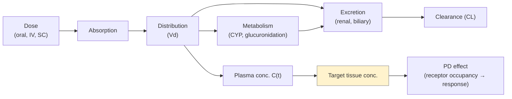

# Pharmacology (PK / PD)

> What the body does to the drug (pharmacokinetics) and what the drug does to the body (pharmacodynamics). The two-line vocabulary every computational scientist working with dose has to know.

A computational chemist who designs a molecule but cannot explain its expected human dose is missing the point of the exercise. PK / PD is how chemistry turns into a dosing regimen.

## Pharmacokinetics in one diagram

*<small>ADME → exposure → pharmacology. The dose is whatever it takes to land target-tissue concentration in the PD window.</small>*

The **four ADME pillars**:

- **A**bsorption — fraction of an oral dose reaching systemic circulation. Bioavailability **F**.
- **D**istribution — volume of distribution **V_d**, plasma-protein binding, tissue partitioning.
- **M**etabolism — enzymatic biotransformation, dominated by hepatic CYPs.
- **E**xcretion — renal and biliary elimination of parent and metabolites.

## One-compartment IV model

Simplest useful model. After an IV bolus, plasma concentration follows mono-exponential decay:

\[
C(t) = \frac{D}{V_d} \cdot e^{-k_{el}\,t}
\]

with elimination rate constant \(k_{el} = CL / V_d\) and half-life \(t_{1/2} = \ln 2 / k_{el} = 0.693\, V_d / CL\).

**AUC** (area under the curve) is the integral of \(C(t)\) and equals \(D / CL\) — clearance is the single most important PK parameter because it sets exposure.

For an oral dose, prepend an absorption phase and a bioavailability factor:

\[
C_{oral}(t) = \frac{F \cdot D \cdot k_a}{V_d (k_a - k_{el})} \left( e^{-k_{el}\,t} - e^{-k_a\,t} \right)
\]

For repeated dosing, **steady state** is reached at ~4–5 half-lives, with \(C_{ss,avg} = F \cdot D / (CL \cdot \tau)\) for dosing interval \(\tau\).

## Pharmacodynamics — Hill / E_max

The standard PD model is the Hill / E_max equation:

\[
E = E_0 + \frac{E_{max} \cdot C^n}{EC_{50}^n + C^n}
\]

- **\(EC_{50}\)** — concentration producing half-maximal effect.
- **\(E_{max}\)** — maximal achievable effect (efficacy).
- **\(n\)** — Hill slope; >1 indicates positive cooperativity, < 1 negative.
- For inhibitors, replace **\(EC_{50}\)** with **\(IC_{50}\)** and \(E_{max}\) becomes maximal inhibition.

For receptor binding *in vitro*, the equivalent is the **\(K_d\)** (or **\(K_i\)** for inhibitors) — concentration occupying half of the receptors.

The Cheng–Prusoff relationship connects \(IC_{50}\) to \(K_i\):

\[
K_i = \frac{IC_{50}}{1 + [S]/K_M}
\]

(for competitive enzyme inhibitors).

## Selectivity, occupancy, and therapeutic window

A drug is rarely a single-target binder. Selectivity is expressed as ratios of IC50 (or K_i) values:

- **On-target / anti-target** ratio. A kinase inhibitor with 100× selectivity against the closest paralog is "good"; 10× is "ok"; 1× is a problem.
- **Receptor occupancy** is what actually correlates with efficacy. A drug at 80% occupancy of the target at trough is typically the design objective for chronic dosing.
- The **therapeutic window** is the ratio of the dose producing tox (TD50, NOAEL) to the dose producing efficacy (ED50, MED). Window ≥ 10× is comforting; < 3× is precarious.

## Reading a PK / PD report

A typical PK report on a candidate gives you:

- **Cmax** — peak plasma concentration.
- **Tmax** — time to peak.
- **AUC_0-∞** — area under the curve, exposure proxy.
- **CL** — clearance (mL/min/kg).
- **V_d (or V_ss)** — volume of distribution (L/kg). > 1 L/kg means tissue partitioning; < 0.2 L/kg means mostly plasma-confined.
- **t_½** — terminal half-life.
- **F** — oral bioavailability (%).
- **fu** — unbound fraction in plasma.

The pharmacologist's interpretation chain is roughly: free unbound exposure (Cu, AUC × fu) → unbound tissue concentration → receptor occupancy → PD effect. The drug-design loop tries to push Cu / AUC_u high enough to maintain occupancy without crossing into toxicity.

## In practice

- The two PK numbers a computational chemist should be able to predict (badly is fine) are **CL** and **V_d**. Together they set half-life and dose frequency.
- The two PD numbers are **EC50/IC50** and **maximal effect**. The first comes from QSAR / docking; the second is mostly empirical.
- **Free drug, not total drug**, is what binds the target. Programs that ignore plasma-protein binding overpromise potency.
- For CNS, the relevant exposure is **brain unbound concentration**, not plasma; see [ADMET → BBB](../admet-tox/bbb.md).

## Where to next

[ADMET overview](admet-overview.md) — A, D, M, E in more depth, plus the T (toxicity).
