# Drug-discovery pipeline

> The end-to-end map of how a candidate becomes a medicine. Where computation actually contributes — and where it does not.

If you remember nothing else from this handbook, remember this diagram and what each arrow costs in time and money.

```mermaid
flowchart LR
    DI["Disease<br/>insight"] --> TI["Target<br/>identification"]
    TI --> TV["Target<br/>validation"]
    TV --> HI["Hit<br/>identification"]
    HI --> HtL["Hit-to-lead"]
    HtL --> LO["Lead<br/>optimisation"]
    LO --> PC["Preclinical<br/>(IND-enabling)"]
    PC --> P1["Phase I<br/>(safety, PK)"]
    P1 --> P2["Phase II<br/>(efficacy)"]
    P2 --> P3["Phase III<br/>(confirmatory)"]
    P3 --> REG["Regulatory<br/>approval"]
    REG --> PMS["Post-marketing /<br/>Phase IV"]

    style HI fill:#e0f7f7,stroke:#444
    style LO fill:#e0f7f7,stroke:#444
    style PC fill:#fff3cd,stroke:#888
    style P3 fill:#f8d7da,stroke:#888
```

*<small>Drug development stages. The right-hand stages dominate cost; the left-hand stages dominate option value.</small>*

## Stage-by-stage

### Target identification (months)

- **Inputs**: disease genetics, omics, literature, knowledge graphs.
- **Outputs**: ranked candidate targets with mechanism hypotheses.
- **Computation**: [Target ID chapter](../target-id/index.md). High leverage.
- **Cost**: low, mostly compute and human time.

### Target validation (6–18 months)

- **Inputs**: genetic perturbation (CRISPR, RNAi), chemical probes, animal models, patient samples.
- **Outputs**: confidence that modulating the target will produce disease modification.
- **Computation**: synthetic-lethality models, MR analyses, KG inference, [target validation](../target-id/validation.md).
- **Cost**: moderate; mostly wet lab.

### Hit identification (6–18 months)

- **Inputs**: target protein / pocket / structure, screening libraries.
- **Outputs**: a handful of chemical series with confirmed activity.
- **Sub-strategies**:
  - **High-throughput screening (HTS)** — physically screen 10^5–10^6 compounds.
  - **Fragment-based** — screen small fragments (MW < 300) by NMR / X-ray / SPR and grow.
  - **DNA-encoded libraries (DEL)** — encode billions of compounds with DNA barcodes, affinity-select.
  - **Virtual screening** — computational ligand-based or structure-based — [Virtual screening](../screening/index.md).
- **Computation**: [Molecular design](../molecular-design/index.md), [Virtual screening](../screening/index.md). Increasingly high leverage.
- **Cost**: moderate to high; depends on assay throughput.

### Hit-to-lead (6–12 months)

- **Inputs**: confirmed hits with measurable activity.
- **Outputs**: leads with potency ≤ 1 µM, baseline ADMET acceptable, IP space cleared.
- **Computation**: QSAR, docking, FEP, ADMET predictors. Iteration cadence increases.
- **Cost**: high — each chemistry cycle is real money.

### Lead optimisation (12–36 months)

- **Inputs**: a chemical series with the right scaffold.
- **Outputs**: a single development candidate (DC) — typically nanomolar at target, > 100× selective, oral PK acceptable, clean ADMET / tox in the early panels.
- **Computation**: MPO, generative chemistry, free-energy methods, integrated ML-in-the-loop. **The highest-density computational stage.**
- **Cost**: tens to low hundreds of millions over the cycle.

### Preclinical / IND-enabling (12–24 months)

- **Inputs**: development candidate.
- **Outputs**: regulatory dossier supporting first-in-human dosing — GLP tox in two species, safety pharmacology, genotoxicity, formulation, manufacturing.
- **Computation**: less than the optimisation stage; mostly PK/PD simulation, allometric scaling to human dose, tox-modelling support.

### Phase I (≤ 1 year, 20–80 subjects)

- **Question**: is it safe? What is the human PK?
- **Outputs**: maximum tolerated dose, dose-exposure relationship, food effect, drug-drug interactions.

### Phase II (1–3 years, 100–500 patients)

- **Question**: does it work? What is the right dose?
- **Outputs**: signal of efficacy, biomarker movement, dose-response in patients.
- **The most expensive failure mode** — most drugs that get killed do so here. Often because the target hypothesis was wrong.

### Phase III (2–5 years, 1 000–10 000 patients)

- **Question**: is the efficacy real and clinically meaningful, at acceptable safety?
- **Outputs**: confirmatory data sufficient for regulatory approval.
- **Cost**: hundreds of millions to over a billion per trial.

### Regulatory approval and post-marketing

- **NDA / BLA** (US FDA), **MAA** (EMA).
- **Phase IV** / real-world evidence continues indefinitely.

## What this costs and how often it works

| Stage | Cycle time | Probability of success to next stage |
| --- | --- | --- |
| Target ID → Hit ID | 1–2 yr | ~60% |
| Hit ID → Lead | ~1 yr | ~50% |
| Lead → DC | 2–3 yr | ~50% |
| DC → IND | 1–2 yr | ~70% |
| Phase I → II | ~1 yr | ~60% |
| Phase II → III | 1–2 yr | ~30% |
| Phase III → Approval | 2–4 yr | ~60% |

Multiplying: from "target chosen" to approved drug is roughly a **~1-in-50 to 1-in-100 game**, taking **10–15 years**, costing on the order of **$1–2 B** including failed programs. The exact numbers vary by source but the order of magnitude is right [DiMasi et al., 2016](https://doi.org/10.1016/j.jhealeco.2016.01.012)[^dimasi].

## Where computation makes the biggest difference

- **Target ID**: choosing a target with strong human-genetics support roughly *doubles* approval probability [Nelson et al., 2015](https://doi.org/10.1038/ng.3314)[^nelson]; [Minikel et al., 2024](https://doi.org/10.1038/s41586-024-07316-0)[^minikel]. Computational target prioritisation matters here.
- **Hit ID and lead optimisation**: virtual screening + generative chemistry + FEP collapses cycle time by months and reduces synthesis-and-test load by orders of magnitude.
- **ADMET prediction**: kills bad compounds before synthesis. Underrated, mature, cheap.
- **Phase II / III**: AI here is mostly biomarker, patient stratification, trial-design support. Less common, very high leverage when it works.

## In practice

- **Map every computational project to a stage of this pipeline.** "Improve docking" without a stage context is a research project; "improve hit-to-lead potency-vs-CYP ranking on programme X" is a project that pays for itself.
- **The stages with the most ML hype are not the stages with the most patient value.** Target ID is the higher-leverage upstream play; clinical biomarkers are the higher-leverage downstream one.
- **Failure data is the most valuable data.** A program that died of unexpected hepatotoxicity tells you more about your tox predictor than 10 000 wins.

## References

[^dimasi]: DiMasi JA, Grabowski HG, Hansen RW. Innovation in the pharmaceutical industry: new estimates of R&D costs. *J Health Econ.* 2016;47:20–33. [doi:10.1016/j.jhealeco.2016.01.012](https://doi.org/10.1016/j.jhealeco.2016.01.012)
[^nelson]: Nelson MR, Tipney H, Painter JL, et al. The support of human genetic evidence for approved drug indications. *Nat Genet.* 2015;47(8):856–860. [doi:10.1038/ng.3314](https://doi.org/10.1038/ng.3314)
[^minikel]: Minikel EV, Painter JL, Dong CC, Nelson MR. Refining the impact of genetic evidence on clinical success. *Nature.* 2024;629:624–629. [doi:10.1038/s41586-024-07316-0](https://doi.org/10.1038/s41586-024-07316-0)

## Where to next

[Computational & math foundations](foundations/index.md) — the prerequisite maths, biology, chemistry, and tooling you will need to do the rest of the handbook.
