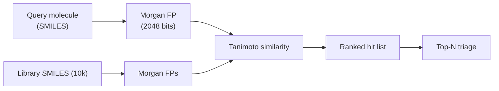

# 3. Your first virtual screen

> A ligand-based similarity screen of a ChEMBL subset against a query. End-to-end, in 30 lines.

## What we are going to do

Given a query molecule (here: imatinib, a kinase inhibitor), rank a library of 10 000 ChEMBL compounds by Tanimoto similarity on ECFP4, and return the top 20.

This is the **simplest possible virtual screen**. It is also surprisingly effective: if your query has known mechanism, a similar molecule is a reasonable first guess at a hit.

## Get a tiny library

For the on-ramp we'll download the full ChEMBL "drug-like" subset and sample 10 000:

```python
import polars as pl
from pathlib import Path

# any 10k-row table with a 'canonical_smiles' column works; the snippet below
# uses ChEMBL's small-molecule SMILES export (chembl_xx_chemreps.txt) but a
# random PubChem subset is equally fine for this demo.
df = pl.read_csv("chembl_chemreps.txt", separator="\t").sample(n=10_000, seed=0)
df = df.select(["chembl_id", "canonical_smiles"])
df.write_parquet("library_10k.parquet")
```

## Build fingerprints once

```python
from rdkit import Chem, DataStructs
from rdkit.Chem import rdFingerprintGenerator
import numpy as np

gen = rdFingerprintGenerator.GetMorganGenerator(radius=2, fpSize=2048)

def to_fp(smi: str):
    mol = Chem.MolFromSmiles(smi)
    return gen.GetFingerprint(mol) if mol else None

lib = df.to_dicts()
for row in lib:
    row["fp"] = to_fp(row["canonical_smiles"])
lib = [r for r in lib if r["fp"] is not None]
```

The `for r in lib if r["fp"] is not None` line is doing real work: ChEMBL has occasional unparseable SMILES — silent failure is the right default during a quick screen, but in production you'd log them.

## Rank against a query

```python
imatinib_smi = "Cc1ccc(NC(=O)c2ccc(CN3CCN(C)CC3)cc2)cc1Nc1nccc(-c2cccnc2)n1"
query_fp = to_fp(imatinib_smi)

sims = np.array([
    DataStructs.TanimotoSimilarity(query_fp, r["fp"]) for r in lib
])
order = np.argsort(-sims)
top20 = [(lib[i]["chembl_id"], lib[i]["canonical_smiles"], float(sims[i]))
         for i in order[:20]]

for cid, smi, s in top20:
    print(f"{cid}  {s:.3f}  {smi[:60]}")
```

On a laptop this runs in well under a second for 10 000 compounds, dominated by the fingerprint build. For 10 million you would batch and parallelise — see [Virtual screening → Ultra-large libraries](../screening/ultra-large.md).

## What just happened (conceptually)



*<small>Ligand-based virtual screening, simplest form.</small>*

Three observations every newcomer should internalise:

1. **You are not asking "is this active?"** — you are asking "is this *similar* to a known active?" That is a weaker claim. You will discover scaffold-hopping pairs that look dissimilar but bind the same pocket, and look-alike pairs that bind nothing.
2. **Tanimoto-on-ECFP4 has known failure modes**. Activity cliffs (very similar molecules, very different potency) are the canonical case. See [AI/ML → Evaluation pitfalls](../ai/evaluation.md).
3. **The library matters as much as the query**. Screening the wrong chemical space (e.g. building blocks vs drug-like vs natural products) will dominate any cleverness in the ranking.

## A slightly better baseline

Pure similarity ignores anything you already know about the target. Two minimal upgrades:

- **Multi-query screen.** Average Tanimoto against *all* known actives, not just one query.
- **Property filter.** Reject hits violating Lipinski / Veber, hits with PAINS substructures, or hits outside an MW / cLogP window.

We will return to both in [Virtual screening → Hit triage](../screening/hit-triage.md).

## In practice

- For ad-hoc screens of < 1 M compounds, ECFP4 + Tanimoto on a laptop is fine.
- For larger libraries, use a fingerprint index ([FPSim2](https://github.com/chembl/FPSim2) or [chemfp](https://chemfp.com)) — billion-compound similarity in seconds is now routine.
- **Always** record: query SMILES, library version, fingerprint type / radius / bits, similarity metric, top-N cut-off. Reproducibility starts here.

## Where to next

[Your first figure](first-figure.md) — turn the hit list into a 2D molecule grid suitable for a slide.
