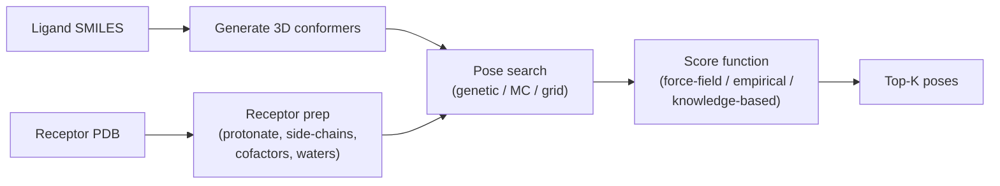

# Docking

> Posing a molecule inside a pocket and scoring the result. The workhorse, the perennial caveat, and the rapid rise of ML-based dockers.

## The classical recipe



The trio of operations: **prepare**, **pose-search**, **score**. Each can fail independently.

## The main dockers

| Docker | Type | Notes |
| --- | --- | --- |
| **AutoDock Vina** [Trott & Olson, 2010](https://doi.org/10.1002/jcc.21334)[^vina] | empirical scoring, MC + local opt | the open-source workhorse |
| **AutoDock GPU**, **Vina-GPU** | GPU-accelerated Vina | for screens |
| **Glide** (Schrödinger) | empirical + ML-tuned | the industry standard, paid |
| **GOLD** (CCDC) | genetic algorithm + ChemPLP | also paid, mature |
| **DOCK 6** (UCSF) | grid + sphere | classical baseline |
| **rDock** | open source, fast | useful for ultra-large screens |
| **smina** | Vina fork with custom-scoring support | great for research |
| **gnina** [McNutt et al., 2021](https://doi.org/10.1186/s13321-021-00522-2)[^gnina] | smina + CNN scoring | strong open-source ML scorer |

## ML / diffusion dockers

The last three years saw a wave of ML dockers replacing or augmenting the classical pipeline:

- **EquiBind** [Stärk et al., 2022](https://doi.org/10.48550/arXiv.2202.05146)[^equibind] — fast, equivariant, end-to-end pose prediction. Single shot.
- **DiffDock** [Corso et al., 2023](https://doi.org/10.48550/arXiv.2210.01776)[^diffdock] — diffusion on rigid-body + torsion. Top-1 RMSDs that beat Vina on standard benchmarks.
- **DiffDock-L** — larger DiffDock variant.
- **AlphaFold3** [Abramson et al., 2024](https://doi.org/10.1038/s41586-024-07487-w)[^af3] — joint protein + ligand prediction; a generalist that often beats specialists.
- **Boltz-1 / Boltz-2** — open-source AF3-class tools.
- **Chai-1** — open-source AF3-class biomolecular complex predictor.

The trend: pure-Vina pipelines are losing ground. ML dockers give better top-1 poses on standard benchmarks (PDBBind, PoseBusters). Vina remains useful for ultra-large screens where ML speed is still limiting and for rigid quality control.

## What docking is good at — and bad at

Good at:

- **Discriminating gross binding modes** — does the ligand sit anywhere near where you expect?
- **Identifying tight pose constraints** for FEP or further refinement.
- **Filtering hopelessly-non-binding poses** in virtual screens.

Bad at:

- **Predicting absolute affinity** — best Vina scoring functions correlate with experimental affinity at Spearman ~0.4 on most benchmarks. Better than chance, far from quantitative.
- **Ranking close-in-affinity congeners** (lead optimisation) — use FEP or PB/SA for this.
- **Handling significant induced fit** — most dockers treat the receptor as rigid.

## Pose validation

A docking pose you cannot reproduce is not useful. Two standards:

- **PoseBusters** [Buttenschoen et al., 2023](https://doi.org/10.48550/arXiv.2308.05777)[^posebusters] — a battery of physical-plausibility checks (bond lengths, clashes, tetrahedral chirality, planar amide).
- **Redocking** to a known co-crystal. Your pipeline should reproduce a holo crystal pose to within 2 Å RMSD on the test ligand; otherwise something is wrong.

A docking benchmark without PoseBusters checks is mis-reporting. ML dockers have been particularly susceptible to "geometrically nonsensical but RMSD-good" poses.

## A minimal Vina run

```bash
# prepare receptor
mk_prepare_receptor.py -i receptor.pdb -o receptor.pdbqt

# prepare ligand
mk_prepare_ligand.py -i ligand.sdf -o ligand.pdbqt

# dock
vina --receptor receptor.pdbqt --ligand ligand.pdbqt \
     --center_x 12.5 --center_y -3.4 --center_z 8.1 \
     --size_x 25 --size_y 25 --size_z 25 \
     --exhaustiveness 32 --num_modes 9 \
     --out ligand_docked.pdbqt
```

The hyperparameters that matter:

- `--exhaustiveness` (default 8). For production, 32–64. Time scales linearly.
- `--num_modes` — keep at least 9 for inspection.
- The grid box must be centred on the pocket and large enough to fit the ligand; too large is wasteful, too small misses poses.

## In practice

- **Always redock** a known crystal ligand at the start of any project. If the pipeline cannot reproduce a known pose, fix it before screening.
- **Run PoseBusters** on all top poses in any reported screen.
- **For virtual screening**, classical Vina at low exhaustiveness is fine; do not over-engineer.
- **For lead optimisation**, use Vina / Glide for pose generation then FEP for affinity ranking.
- **ML dockers are now competitive**; trial them on your specific pocket against classical Vina before adopting.

## References

[^vina]: Trott O, Olson AJ. AutoDock Vina: improving the speed and accuracy of docking with a new scoring function, efficient optimization, and multithreading. *J Comput Chem.* 2010;31(2):455–461. [doi:10.1002/jcc.21334](https://doi.org/10.1002/jcc.21334)
[^gnina]: McNutt AT, Francoeur P, Aggarwal R, et al. GNINA 1.0: molecular docking with deep learning. *J Cheminform.* 2021;13:43. [doi:10.1186/s13321-021-00522-2](https://doi.org/10.1186/s13321-021-00522-2)
[^equibind]: Stärk H, Ganea O-E, Pattanaik L, Barzilay R, Jaakkola T. EquiBind: geometric deep learning for drug binding structure prediction. *arXiv:2202.05146.* 2022. [doi:10.48550/arXiv.2202.05146](https://doi.org/10.48550/arXiv.2202.05146)
[^diffdock]: Corso G, Stärk H, Jing B, Barzilay R, Jaakkola T. DiffDock: diffusion steps, twists, and turns for molecular docking. *arXiv:2210.01776.* 2023. [doi:10.48550/arXiv.2210.01776](https://doi.org/10.48550/arXiv.2210.01776)
[^af3]: Abramson J, Adler J, Dunger J, et al. Accurate structure prediction of biomolecular interactions with AlphaFold 3. *Nature.* 2024;630:493–500. [doi:10.1038/s41586-024-07487-w](https://doi.org/10.1038/s41586-024-07487-w)
[^posebusters]: Buttenschoen M, Morris GM, Deane CM. PoseBusters: AI-based docking methods fail to generate physically valid poses or generalise to novel sequences. *arXiv:2308.05777.* 2023. [doi:10.48550/arXiv.2308.05777](https://doi.org/10.48550/arXiv.2308.05777)

## Where to next

[Free-energy methods](free-energy.md) — when docking ranks are not enough, the expensive workhorse takes over.
