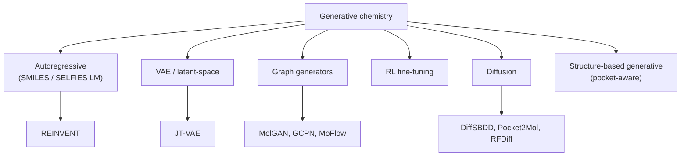

# Generative chemistry

> Models that *propose* molecules instead of merely scoring them. SMILES language models, graph generators, VAEs, RL, diffusion. The honest version of "AI for drug design".

The promise: instead of searching a pre-built library, design molecules de novo. The reality: it works, but only when the design loop includes synthesis, ADMET, and chemist feedback. A generator alone is not a discovery engine.

## The taxonomy



## 1. Autoregressive SMILES / SELFIES language models

A transformer or RNN trained left-to-right on SMILES (or SELFIES). Generation is sampling tokens until a stop token.

- **Pro**: simple, fast, strong on basic druglikeness.
- **Con**: token-level invalidity (SMILES); only learns from what was in training (limited novelty).
- **Tools**: REINVENT 4 [Loeffler et al., 2024](https://doi.org/10.1186/s13321-024-00812-5)[^reinvent4], MolGPT, ChemLM variants.

REINVENT is the workhorse open-source generative model: SMILES LM pre-trained on ChEMBL, fine-tuned by reinforcement learning against multi-parameter rewards. It is the right starting point for almost any generative project.

## 2. VAE / latent-space models

Encode molecules into a continuous latent space, decode back. Latent-space optimisation is then a continuous problem.

- **JT-VAE** [Jin et al., 2018](https://doi.org/10.48550/arXiv.1802.04364)[^jtvae] — encodes a junction tree + a molecular graph; high validity.
- **CharVAE / CDDD** — character-level VAE.
- **Pro**: smooth latent, Bayesian-opt-friendly.
- **Con**: complex; decoder can drift off-distribution.

Less in vogue in 2025 than autoregressive + RL, but still useful for property-conditional generation.

## 3. Graph generators

Generate molecular graphs directly: add atoms, add bonds, decide stop.

- **GCPN** [You et al., 2018](https://doi.org/10.48550/arXiv.1806.02473)[^gcpn] — RL-based graph construction.
- **MoFlow**, **GraphAF** — normalising-flow-based.
- **MolGAN** — small-molecule GAN.

Stronger guarantees of validity (the graph is built up legally) at the cost of complexity. Rarely state-of-the-art in 2025 benchmarks, but interpretable.

## 4. RL fine-tuning

The most important meta-technique. Any base generative model + an external reward = a target-aware generator.

```python
# pseudo:
for step in range(steps):
    smis = base_model.sample(batch_size=64)
    rewards = score(smis)            # potency + property + SA + ...
    advantages = rewards - baseline
    base_model.update(smis, advantages)
```

This is the REINFORCE loop at the heart of REINVENT, MolDQN, and others. The hard parts are not the algorithm; they are:

1. **Reward shaping** — combining 5+ objectives without one dominating.
2. **Reward hacking** — the model finds molecules that score artificially well (SA score loves heavily fused aromatics that nobody can synthesise).
3. **Exploration / exploitation** — entropy regularisation, diversity penalties.

## 5. Diffusion / score-based models

Diffusion has eaten generative modelling for images; chemistry is following.

- **EDM**, **GeoDiff** — 3D conformer diffusion.
- **DiffSBDD** [Schneuing et al., 2024](https://doi.org/10.1038/s43588-024-00697-2)[^diffsbdd] — pocket-conditioned 3D molecular diffusion.
- **DiffDock** [Corso et al., 2023](https://doi.org/10.48550/arXiv.2210.01776)[^diffdock] — diffusion for docking (covered in [Docking](docking.md)).

Diffusion's strengths are 3D consistency and conditional generation. Its weakness is sample efficiency.

## 6. Structure-based generative (pocket-aware)

The big shift of 2022–2025: generate molecules *inside* the pocket.

- **Pocket2Mol** [Peng et al., 2022](https://doi.org/10.48550/arXiv.2205.07249)[^pocket2mol] — autoregressive atom placement inside a pocket.
- **DiffSBDD**, **TargetDiff** — diffusion-based.
- **RFDiffusion + RFDock** family — Baker lab's protein-design tools adapted to ligand design.

These models output 3D structures *and* SMILES, optimised against pocket complementarity. They are still behind hand-engineered structure-based design for affinity but rapidly improving.

## Multi-parameter rewards

The honest objective for a generative model in production is:

\[
R(m) = w_1 \cdot \text{pIC50}(m, T) + w_2 \cdot \text{Selectivity}(m) + w_3 \cdot \text{QED}(m) + w_4 \cdot (-\text{SA}(m)) + w_5 \cdot (1 - p_{\text{hERG}}(m)) + \ldots
\]

…each term coming from a downstream ML model with its own error budget. See [Multi-parameter optimization](mpo.md).

The trap: a generator that maximises R can find regions of chemical space where the *predictors* are inaccurate (out-of-distribution). Uncertainty-aware rewards mitigate this.

## Synthesis-aware generation

A generated molecule that no chemist can make is computationally pretty and clinically irrelevant.

- **SA score** — fast filter.
- **SCScore** — learned, faster than retrosynthesis but coarser.
- **RAscore** — explicit retrosynthesis-success classifier.
- **AiZynthFinder** [Genheden et al., 2020](https://doi.org/10.1186/s13321-020-00472-1)[^aizynth] — runs an actual retrosynthesis on every candidate; slow but precise.

Modern pipelines run AiZynthFinder over the top-K generated molecules and feed the success rate back into reward.

## In practice

- **REINVENT 4 with a multi-parameter scorer is the right industrial default** in 2025. Open source, battle-tested.
- **Use uncertainty-aware rewards** — penalise OOD predictions, not just confidently bad ones.
- **Hold the chemist in the loop**. Generate 1000 ideas, get a chemist to triage 20, synthesise 5, measure, retrain. The discipline of "generative chemistry in production" is mostly about this loop.
- **Pocket-aware methods are improving fast** but rarely beat well-set-up REINVENT + a fast structure-aware reward (e.g. docking score) in 2025. Watch the next 24 months.

## References

[^reinvent4]: Loeffler HH, He J, Tibo A, et al. REINVENT 4: modern AI–driven generative molecule design. *J Cheminform.* 2024;16:20. [doi:10.1186/s13321-024-00812-5](https://doi.org/10.1186/s13321-024-00812-5)
[^jtvae]: Jin W, Barzilay R, Jaakkola T. Junction tree variational autoencoder for molecular graph generation. *arXiv:1802.04364.* 2018. [doi:10.48550/arXiv.1802.04364](https://doi.org/10.48550/arXiv.1802.04364)
[^gcpn]: You J, Liu B, Ying R, Pande V, Leskovec J. Graph convolutional policy network for goal-directed molecular graph generation. *arXiv:1806.02473.* 2018. [doi:10.48550/arXiv.1806.02473](https://doi.org/10.48550/arXiv.1806.02473)
[^diffsbdd]: Schneuing A, Du Y, Harris C, et al. Structure-based drug design with equivariant diffusion models. *Nat Comput Sci.* 2024;4:899–909. [doi:10.1038/s43588-024-00697-2](https://doi.org/10.1038/s43588-024-00697-2)
[^diffdock]: Corso G, Stärk H, Jing B, Barzilay R, Jaakkola T. DiffDock: diffusion steps, twists, and turns for molecular docking. *arXiv:2210.01776.* 2023. [doi:10.48550/arXiv.2210.01776](https://doi.org/10.48550/arXiv.2210.01776)
[^pocket2mol]: Peng X, Luo S, Guan J, Xie Q, Peng J, Ma J. Pocket2Mol: efficient molecular sampling based on 3D protein pockets. *arXiv:2205.07249.* 2022. [doi:10.48550/arXiv.2205.07249](https://doi.org/10.48550/arXiv.2205.07249)
[^aizynth]: Genheden S, Thakkar A, Chadimová V, et al. AiZynthFinder: a fast, robust and flexible open-source software for retrosynthetic planning. *J Cheminform.* 2020;12:70. [doi:10.1186/s13321-020-00472-1](https://doi.org/10.1186/s13321-020-00472-1)

## Where to next

[Structure-based design](structure-based.md) — pocket-aware methods in more depth.
