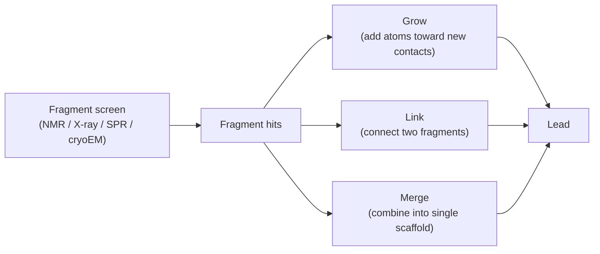

# Structure-based design

> Designing molecules with explicit knowledge of the binding pocket. Fragment growing / linking / merging, scaffold hopping with pocket constraints, hot-spot exploitation.

## Why structure helps

If you have a high-resolution co-crystal of a target with even a weak ligand, you can do four things ligand-only methods cannot:

1. **See what the pocket likes** — which residues are hydrophobic, polar, charged.
2. **Identify hot spots** — sub-pocket regions where adding atoms gains affinity disproportionately.
3. **Pin down binding mode** — which orientation of a flexible molecule actually fits.
4. **Predict selectivity** — by comparing pockets across paralogs.

Structure does not eliminate empirical iteration; it makes each iteration carry more information.

## Hot-spot identification

Tools that map pocket regions where small fragments bind preferentially:

- **FTMap** [Brenke et al., 2009](https://doi.org/10.1093/bioinformatics/btn656)[^ftmap] — computational solvent mapping; 16 small organic probes positioned across the pocket.
- **GRID** [Goodford, 1985](https://doi.org/10.1021/jm00145a002)[^grid] — molecular interaction fields; classical, still useful.
- **MD-based** approaches (SILCS, WaterMap) — analyse water structure and probe binding in dynamic ensembles.

A hot spot is a region where adding a methyl, an aromatic, or a polar group is *expected* to gain ~1–2 kcal/mol. Programs that ignore the hot-spot map waste cycles re-discovering the same lessons.

## Fragment-based methods

Fragment-based drug discovery (FBDD) starts from very small (MW < 300) weakly-binding fragments and grows them into leads.

Three transformations cover essentially all of FBDD evolution: grow, link, merge. Computational tools that operationalise them:

- **OpenGrowth, AutoGrow** — fragment growing with scoring.
- **CrossDocked2020** [Francoeur et al., 2020](https://doi.org/10.1021/acs.jcim.0c00411)[^crossdocked] — training set for pocket-aware ML.
- **DeLinker, DEVELOP** — ML-based linker generation.
- **DiffLinker** [Igashov et al., 2024](https://doi.org/10.1038/s42256-024-00815-9)[^difflinker] — diffusion-based linker design.

## Pocket-aware generative models

Modern generative tools (see [Generative chemistry](generative.md)) increasingly accept the pocket as input:

- **Pocket2Mol**, **TargetDiff**, **DiffSBDD**, **3DGen**, **PocketCrafter**.
- They produce 3D-positioned molecules directly inside the pocket.

The honest 2025 assessment: pocket-aware generation is a strong research direction with steadily improving results. It is not yet a one-click replacement for "REINVENT + docking-as-reward". But the trend is clear.

## Selectivity by pocket comparison

For paralog selectivity (kinases, GPCRs, nuclear receptors), comparing pockets across family members and designing for differences is a productive technique.

- **Pocket alignment**: structural alignment of pockets across the family (e.g. with KLIFS for kinases).
- **Identify discriminating residues**: residues that differ between the target and the closest anti-target.
- **Design vectors that engage the discriminating residue** in the target and clash with it (or are neutral) in the anti-target.

This is how selectivity ratios of > 100× are achieved on closely-related kinases without throwing away potency.

## In practice

- Always **inspect the co-crystal** before opening a generative tool. A 10-minute look at a 1.5 Å structure with PyMOL is more useful than 10 hours of model training without it.
- **Hot-spot identification** (FTMap or GRID) is the first computational step after structure receipt.
- **Build a small fragment hierarchy** for the pocket: which substructures bind, which subsites do they occupy, what affinity do they give. This is the right input to any later generative campaign.
- **Validate computational predictions with a few synthesised compounds** in the first cycle. Models that have not been calibrated against your specific pocket are unreliable.

## References

[^ftmap]: Brenke R, Kozakov D, Chuang G-Y, et al. Fragment-based identification of druggable "hot spots" of proteins using Fourier domain correlation techniques. *Bioinformatics.* 2009;25(5):621–627. [doi:10.1093/bioinformatics/btn656](https://doi.org/10.1093/bioinformatics/btn656)
[^grid]: Goodford PJ. A computational procedure for determining energetically favorable binding sites on biologically important macromolecules. *J Med Chem.* 1985;28(7):849–857. [doi:10.1021/jm00145a002](https://doi.org/10.1021/jm00145a002)
[^crossdocked]: Francoeur PG, Masuda T, Sunseri J, et al. Three-dimensional convolutional neural networks and a cross-docked data set for structure-based drug design. *J Chem Inf Model.* 2020;60(9):4200–4215. [doi:10.1021/acs.jcim.0c00411](https://doi.org/10.1021/acs.jcim.0c00411)
[^difflinker]: Igashov I, Stärk H, Vignac C, et al. Equivariant 3D-conditional diffusion model for molecular linker design. *Nat Mach Intell.* 2024;6:417–427. [doi:10.1038/s42256-024-00815-9](https://doi.org/10.1038/s42256-024-00815-9)

## Where to next

[Docking](docking.md) — scoring how a molecule fits in a pocket.
