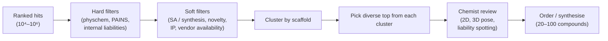

# Hit triage

> Turning a ranked list of computational hits into a synthesis-and-test plan a chemist can execute.

The output of a virtual screen is a sorted CSV. The output of triage is *the* 20–100 compounds that will be made. The gap between those two is where most virtual-screening campaigns succeed or fail.

## The triage funnel



## Hard filters

Apply *before* manual review:

- **Physchem**: MW, logP, TPSA, HBA, HBD, RotB within the target window. CNS programs apply tighter bounds.
- **PAINS** ([Baell & Holloway, 2010](https://doi.org/10.1021/jm901137j)) — RDKit ships the filter catalogue.
- **Internal liability filters** — reactive groups, known hERG-prone motifs, Michael acceptors, aldehydes, mutagenic alerts (ICH M7 / Mol-CDV2).
- **Tox alerts** — Brenk filters, ChEMBL filters, internal blacklists.

```python
from rdkit.Chem import rdfiltercatalog
params = rdfiltercatalog.FilterCatalogParams()
params.AddCatalog(rdfiltercatalog.FilterCatalogParams.FilterCatalogs.PAINS)
params.AddCatalog(rdfiltercatalog.FilterCatalogParams.FilterCatalogs.BRENK)
catalog = rdfiltercatalog.FilterCatalog(params)
mols_filtered = [m for m in mols if not catalog.HasMatch(m)]
```

The PAINS-Brenk pair filters ~15% of typical virtual-screen output. Catching these in code before chemist review respects their time.

## Soft filters

- **Synthetic accessibility** — SA score, RAscore, or AiZynthFinder retrosynthesis success.
- **Novelty / patent space** — InChIKey lookup against in-house and patent databases. A compound that matches a competitor patent is dead on arrival.
- **Vendor availability** — for purchase-and-test campaigns, in-stock vs make-on-demand changes lead time by 10×.
- **Anti-target prediction** — if you have hERG / CYP / kinase-panel QSAR models, run them.

## Clustering and diversity

Without clustering, the top of any ranking is dominated by one scaffold. The fix: scaffold-cluster the survivors and pick diverse exemplars.

```python
from rdkit.Chem.Scaffolds.MurckoScaffold import GetScaffoldForMol
from collections import defaultdict

clusters = defaultdict(list)
for mol in mols_filtered:
    scaf = Chem.MolToSmiles(GetScaffoldForMol(mol))
    clusters[scaf].append(mol)

# pick top-N per cluster, capped by total
short_list = []
for scaf, members in sorted(clusters.items(), key=lambda kv: -max(m.score for m in kv[1])):
    members.sort(key=lambda m: -m.score)
    short_list += members[:3]
    if len(short_list) >= 200:
        break
```

A diverse top 100 — 30 scaffolds with 3 examples each — gives a chemist the right surface to make actionable picks.

## Chemist review

Once filtered and clustered, a chemist looks at each survivor and:

- **Spots subtle liabilities** the filters missed.
- **Judges synthetic feasibility** beyond what SA score captures.
- **Flags scaffolds with known liabilities** they recall from prior programs.
- **Identifies SAR-rich neighbourhoods** worth expanding.
- **Picks the final 20–100 to order**.

Tools that help: `mols2grid` for interactive triage, in-house tools for docking-pose visualisation, retrosynthesis viewers.

A good triage interface lets the chemist:

- Sort by any score column.
- Filter by substructure SMARTS.
- See the binding-pose overlay alongside 2D.
- Flag compounds with one click for ordering or rejection.

## Ordering and testing strategy

- **Single-concentration screens** first (e.g. one dose at 10 µM) — cheap, fast, narrows to 20–30% hits.
- **Dose-response** on the survivors — IC50s, max-effect.
- **Orthogonal assay** (different format, different lab) on the top ~10 — guards against assay artefacts.
- **Selectivity panel** — at minimum, the close paralogs.

A triage round produces useful information *whether or not* the campaign succeeds:

- A high false-positive rate → your scoring is poorly calibrated for this pocket.
- A high false-negative rate (compounds with low score that are active) → your library or pipeline is missing chemotypes.

## In practice

- **Do not bypass manual chemist review.** Software triage finds the wrong compounds in ways chemists immediately spot.
- **Order in tranches** — 50 first, retrain on the assay data, then order another 50. Don't blow the synthesis budget in one shot.
- **Log every triage decision and outcome**. The data feeds the next ML model.
- **Hit rates of 5–20% on triaged-and-tested compounds** are normal for a well-set-up campaign. < 1% suggests pipeline problems.

## Where to next

[ADMET & toxicity](../admet-tox/index.md) — the next gate after potency.
