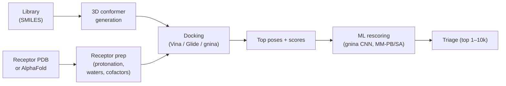

# Structure-based screening

> Docking at library scale. ML-rescoring, ensemble docking, the practical caveats.

When you have a high-quality co-crystal of the target with a representative ligand, structure-based screening is usually the higher-information channel. When you don't (or the co-crystal is dirty / low-resolution / liganded with a fragment that misrepresents the binding mode), it can be misleading.

## The canonical pipeline

## Receptor preparation

The single biggest source of bad docking is bad receptor preparation. The non-negotiable steps:

1. **Choose the right structure**: holo (with a representative ligand) > apo > AlphaFold prediction. If using AlphaFold, check pLDDT in the pocket.
2. **Protonation**: side-chain and ligand pKa at the assay pH. Tools: PROPKA, PDB2PQR, Maestro Protein Prep Wizard.
3. **Tautomers and rotamers**: for histidine especially. Choose the tautomer consistent with H-bond network.
4. **Waters**: bridging waters are sometimes worth keeping (WaterMap analysis identifies which); structural waters in pockets often improve docking.
5. **Cofactors**: ATP, NADP, Mg²⁺, Zn²⁺ — keep them if they are part of the active state.
6. **Grid box**: centred on the pocket centroid, large enough to fit any reasonable ligand.

A 30-minute receptor-prep step saves days of debugging downstream.

## Library preparation

- **Standardise** SMILES, neutralise / re-ionise, canonical tautomer, expand stereoisomers if needed.
- **Generate 3D conformers** with ETKDG; for docking, the dockers do their own pose search but a clean 3D start helps.
- **Pre-filter on physchem** before docking: MW, RotB, HBD, HBA, PAINS, internal liability filters. A pre-filter that removes 50% of the library before the expensive step costs nothing.

## Scaling docking

A single CPU dock costs ~10–60 seconds per compound at typical exhaustiveness. For 10⁶ compounds → roughly 100 CPU-days. Realistic options:

| Approach | Throughput | Notes |
| --- | --- | --- |
| Vina on CPU cluster | 10⁵ / day per 100 cores | linear scaling; simple |
| Vina-GPU / AutoDock-GPU | 10⁶ / day per GPU | order of magnitude faster |
| rDock | 10⁶ / day per 100 cores | older, fast |
| ML-based (EquiBind, DiffDock) | 10⁷ / day per GPU | pose quality has caught up |
| FastROCS-style coarse | 10⁹ / day per GPU | shape only, no pose |

For ultra-large libraries see [Ultra-large libraries](ultra-large.md).

## ML rescoring

Vina scores correlate with affinity only at Spearman ~0.3–0.5 on most public benchmarks. Re-ranking the top of the docking output with ML often improves top-X hit rates.

Tools:

- **gnina** — Vina pose generation + a CNN scoring function trained on PDBBind.
- **PIGNet, EquiScore** — graph-based scorers for re-ranking.
- **MM-PB/SA, MM-GB/SA** — molecular-mechanics + implicit-solvent rescoring; physically grounded.

A workflow that runs Vina for pose search, gnina (or another ML scorer) for re-ranking, and MM-GB/SA on the top 1% gives near-state-of-the-art enrichment without going to FEP.

## Ensemble docking

A single receptor structure misses dynamic pocket states. Running docking against an *ensemble* of receptor structures — from MD snapshots, crystal apo / holo states, or homology / AlphaFold variants — can recover ligands that bind to a state not represented in the original PDB.

- **MD-RAMD**, **relaxed complex method** [Lin et al., 2002](https://doi.org/10.1021/ja011218j)[^relax] — MD-derived receptor ensembles.
- **Ensemble docking with PROPKA-adjusted protonation states**.

Tradeoffs: ensemble docking trades compute for more flexible pocket representations. Use when a single state seems too rigid for the chemical space you are exploring.

## What can go wrong

- **Wrong pocket** — pipeline docks into a crystal-packing artefact or a cryptic exit channel.
- **Wrong protonation** — a histidine pose looks great in the docked output but the histidine is the wrong tautomer.
- **Missing water** — a bridging water that should be displaced is "kept" in the prep, false-positively rejecting ligands that would have worked.
- **PoseBusters failures** — chiral inversion, planar amide twisted, ring strain. Apply [PoseBusters](https://doi.org/10.48550/arXiv.2308.05777) checks always.

## In practice

- **Always validate your pipeline with a known-actives redock** before any prospective screen.
- **Always pre-filter the library** by physchem and substructure liability — most "screen hits" are filterable noise.
- **Always rescore the top of the dock output** with a complementary scorer.
- **Don't trust an AlphaFold-only pocket** without validating against a known ligand.

## References

[^relax]: Lin J-H, Perryman AL, Schames JR, McCammon JA. Computational drug design accommodating receptor flexibility: the relaxed complex scheme. *J Am Chem Soc.* 2002;124(20):5632–5633. [doi:10.1021/ja011218j](https://doi.org/10.1021/ja011218j)

## Where to next

[Ultra-large libraries](ultra-large.md) — what changes at 10⁹ compounds.
