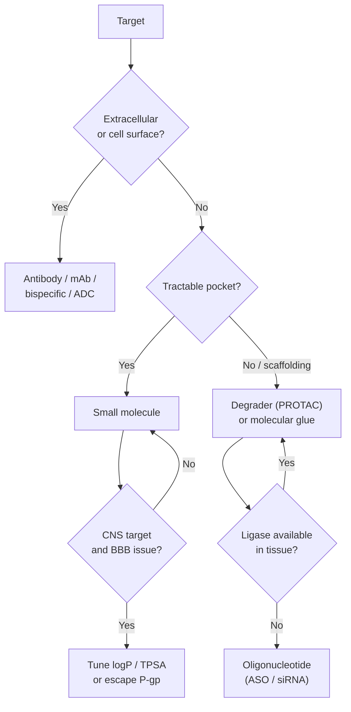

# Druggability

> Even with perfect target validation, the question remains: can a drug of *some* modality engage this target sufficiently? This page is about that.

Druggability is the joint of three things:

1. **Structural tractability** — is there a pocket / surface a drug can occupy?
2. **Modality fit** — small molecule, biologic, oligo, degrader, cell, gene therapy?
3. **Localisation** — can the drug get to where the target is?

## Structural tractability

For small molecules, a tractable pocket typically has:

| Property | Tractable | Untractable |
| --- | --- | --- |
| Volume | 300–1000 ų | < 200 ų or huge & shallow |
| Buriedness | enclosed | flat / solvent-exposed |
| Polar / hydrophobic mix | mixed | all-charged or all-hydrophobic |
| Hot spots | identifiable | diffuse |
| Dynamics | moderate flexibility | rigid or fully disordered |

For biologics, "tractable" instead means accessible to a binder ~150 kDa: typically extracellular or cell-surface.

For oligo, "tractable" usually means well-expressed in delivery-accessible tissue with a non-repetitive 18–25-nt window.

## Pocket detection tools

| Tool | Approach | Notes |
| --- | --- | --- |
| **FPocket** [Le Guilloux et al., 2009](https://doi.org/10.1186/1471-2105-10-168)[^fpocket] | α-sphere geometric | Free, fast, command-line |
| **P2Rank** | ML on geometric features | Free, often the strongest open-source baseline |
| **DeepPocket** | 3D CNN on voxelised surface | Free |
| **DoGSiteScorer** | Geometric + chem features | Web service |
| **SiteMap** (Schrödinger) | Geometric + chem | Commercial; widely used in industry |
| **PocketMiner** | DL on MD ensembles | Detects cryptic pockets |

Most teams run one geometric and one ML method and look for consensus. A pocket flagged by both is more credible.

## Cryptic pockets

A *cryptic* pocket is one not visible in the crystal structure but populated under dynamics, ligand binding, or post-translational modification.

KRAS G12C was famously "undruggable" until a cryptic Cys-12-adjacent pocket was found and exploited by sotorasib [Canon et al., 2019](https://doi.org/10.1038/s41586-019-1694-1)[^kras]. Modern cryptic-pocket detection (MD simulations, ML, FTMap) is now standard for nominally-flat targets.

## Modality decision tree

*<small>A heuristic modality decision tree. Real teams iterate.</small>*

## Localisation: where is the drug going?

- **Plasma-confined target**: standard PK; renal / hepatic clearance.
- **Extracellular but extravascular** (e.g. tumour ECM): need permeability beyond endothelium.
- **Intracellular cytosolic**: must cross plasma membrane. Hydrophilic biologics → no. Small molecules → yes if drug-like.
- **Nuclear**: cytosol + nuclear membrane; usually trivial for small mols if they reach cytosol.
- **Mitochondrial**: needs special targeting; rare.
- **CNS**: BBB problem — see [ADMET → BBB](../admet-tox/bbb.md).
- **Intracellular bacterial / viral**: drug must enter host *and* pathogen compartment.

A "validated, tractable" target whose drug cannot reach it is still untreatable.

## Tractability databases

- **canSAR** — cancer-leaning, integrates structures, ligands, druggability scores.
- **DrugnomeAI / IDG-TCRD** — pan-target tractability classification.
- **OpenTargets** has a "Tractability" tab per target with curated annotations.

## In practice

- **Run pocket detection on AlphaFold structures by default**. Confidence is now high enough for non-disordered regions.
- **Consider degraders for scaffolding / TF targets**. The PROTAC modality has changed what "druggable" means.
- **Consider biologics for cell-surface targets** even when small molecules are possible — ADCs and bispecifics may give better selectivity.
- **Localisation kills more programmes than potency**. Solving "can the drug get there?" upfront avoids wasted years.

## References

[^fpocket]: Le Guilloux V, Schmidtke P, Tuffery P. Fpocket: an open source platform for ligand pocket detection. *BMC Bioinformatics.* 2009;10:168. [doi:10.1186/1471-2105-10-168](https://doi.org/10.1186/1471-2105-10-168)
[^kras]: Canon J, Rex K, Saiki AY, et al. The clinical KRAS(G12C) inhibitor AMG 510 drives anti-tumour immunity. *Nature.* 2019;575:217–223. [doi:10.1038/s41586-019-1694-1](https://doi.org/10.1038/s41586-019-1694-1)
