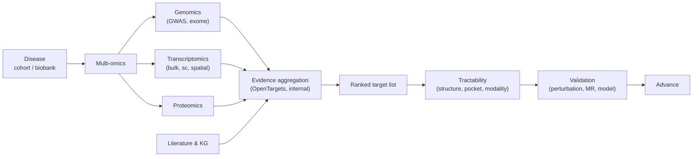

# Target identification

> Finding the protein, RNA, gene, or pathway whose modulation will move the disease. The single highest-leverage stage of drug discovery.

A wrong target with a perfect molecule produces nothing. A right target with a mediocre molecule produces medicine. This section is about getting the target right.

## Chapters

- **[Genomics](genomics.md)** — GWAS, exome sequencing, loss-of-function carriers, Mendelian randomisation. The strongest causal evidence.
- **[Transcriptomics](transcriptomics.md)** — bulk RNA-seq, single-cell, perturbation atlases (CMap / LINCS), spatial transcriptomics.
- **[Proteomics](proteomics.md)** — mass-spec proteomes, phosphoproteomics, affinity-based interactomes (AP-MS, BioID).
- **[Network & pathway biology](networks.md)** — protein-protein interactions, regulatory networks, pathway databases, network-propagation methods.
- **[Literature & knowledge graphs](literature.md)** — biomedical text mining, OpenTargets, KGs, embedding methods.
- **[Target validation](validation.md)** — chemical probes, CRISPR perturbation, animal models. The wet-lab side computationalists need to read.
- **[Druggability](druggability.md)** — pocket detection, structural tractability, modality fit.

## The three questions

Every target-ID exercise eventually answers:

1. **Is the target causal?** — does modulating it actually change the disease?
2. **Is it tractable?** — can a tractable molecule of *some* modality engage it sufficiently?
3. **Is the therapeutic window plausible?** — can you hit it hard enough without intolerable on- or off-target tox?

The strongest stories combine human-genetic causality, multi-omics convergence, and structural tractability. Programs that lack any one of these can still work, but each missing leg roughly halves the probability of clinical success.

## A canonical workflow

The chapters in this section follow that flow. The deliverable is a *ranked, defensible* target list with explicit evidence per row — not a single "the target".

## What computation actually contributes

- **Aggregating heterogeneous evidence** into a single ranked list with explicit weights.
- **Multi-omics integration** — single cell + bulk + spatial + proteomics across the same disease cohort.
- **Causal inference** — Mendelian randomisation, instrumental variable analyses.
- **Pocket detection** at scale on AlphaFold structures.
- **Network propagation** to surface module members from seed genes.
- **KG embedding** to rank candidate target-disease pairs.
- **Literature mining** to summarise the prior at scale.

The single biggest failure mode is **lack of curation**. A KG output ranking a target highly because it is associated with 50 papers, of which 49 are reviews, is exactly the kind of statistic that misleads a program for years.

## Where to next

[Genomics](genomics.md) — the strongest causal evidence, and the right starting point for almost every target-ID exercise.
