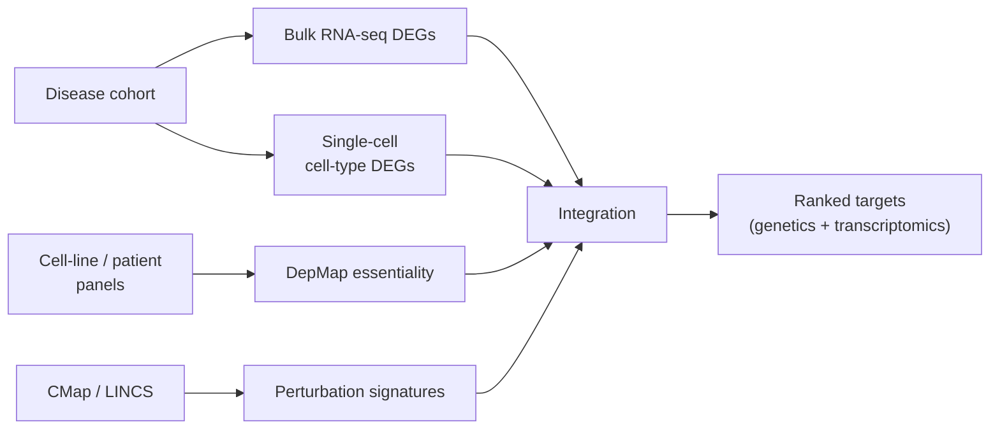

# Transcriptomics for target identification

> Bulk RNA-seq, single-cell, perturbation atlases (CMap / LINCS), spatial transcriptomics. Finding the right *cell type* and the right *state*.

A target whose expression and signalling lives in the wrong cell type is essentially a different target. Transcriptomics is the discipline of figuring out what is expressed where, when, and how it changes.

## Bulk RNA-seq

The workhorse for the last decade. Sample tissue → sequence → align → quantify → call differential expression between disease and control.

- **Pipelines**: STAR / Salmon / Kallisto for quantification; DESeq2 / edgeR / limma-voom for differential expression.
- **Reference resources**: GTEx (healthy tissue baselines), TCGA (cancer), ARCHS4 (compendium re-quantified).
- **Output**: per-gene log fold-change, statistical significance, sometimes gene-set enrichments (GSEA, fgsea).

The right way to use bulk DEGs for target-ID:

1. Identify disease-vs-control DEGs in the disease-relevant tissue.
2. Intersect with *druggable* gene sets (UniProt protein class, IDG TCRD, Drug-Gene Interaction database).
3. Cross-reference with genetic evidence (OpenTargets).
4. Manually triage the top 50.

## Single-cell RNA-seq

Bulk averages across cell types and hides the actually-interesting biology. Single-cell resolution exploded after 2015.

- **Platforms**: 10x Chromium, Smart-seq, sci-RNA-seq, Parse Biosciences.
- **Pipelines**: Cell Ranger, scanpy (Python), Seurat (R).
- **Atlases**: Human Cell Atlas, Tabula Sapiens / Muris, Allen Brain Atlas, Sanger Cell Atlas.

The questions single-cell answers that bulk could not:

- **Which cell type expresses my target?** A "pan-tissue" expressed gene may be active in only 0.5 % of cells.
- **Does target expression shift in disease cell states?** Microglial-state transitions in neurodegeneration; epithelial-mesenchymal in cancer; T-cell exhaustion in solid tumours.
- **Are there cell-type-specific isoforms or splice variants?**

For a CNS programme, the [NeuroStack](https://github.com/phindagijimana/neuro_stack) imaging-genetics chapters complement single-cell — knowing the brain region and cell type of action are both required.

## Spatial transcriptomics

The next step: keep cell-resolution *and* spatial context.

- **Visium, Xenium, MERFISH, slide-seq**: different resolution / multiplexing trade-offs.
- For oncology, tumour micro-environment composition predicts immunotherapy response — a use case spatial uniquely addresses.

## Perturbation atlases

The Connectivity Map (CMap) and its modern descendant LINCS-L1000 [Subramanian et al., 2017](https://doi.org/10.1016/j.cell.2017.10.049)[^lincs] catalogued gene-expression signatures induced by ~30 000 perturbations (small molecules, CRISPR knockouts, shRNA) across multiple cell lines.

The signature-matching trick:

- Take a *disease* signature (genes up / down in disease vs. control).
- Search CMap for perturbations whose signature is **opposite** to the disease signature.
- Those perturbations are predicted to reverse the disease state → repurposing candidates.

CMap / LINCS is the canonical resource for [signature-based repurposing](../repurposing/signature-based.md).

Genome-wide CRISPR perturbation expression atlases (Perturb-seq, Sci-Plex, Replogle's whole-genome Perturb-seq [Replogle et al., 2022](https://doi.org/10.1016/j.cell.2022.05.013)[^replogle]) are now extending CMap to gene-level resolution.

## Cell-line essentiality (DepMap)

Adjacent to transcriptomics: the Cancer Dependency Map (DepMap) [Tsherniak et al., 2017](https://doi.org/10.1016/j.cell.2017.06.010)[^depmap] ran genome-wide CRISPR essentiality screens across ~1 000 cancer cell lines.

For oncology target ID, DepMap is non-negotiable:

- A target whose loss is *selectively* lethal in cell lines with a particular genetic background is the textbook synthetic-lethality story.
- BRD4 in MYC-amplified cells, MTH1 in oxidative-stress cells, PARP in BRCA-deficient cells.
- The portal allows querying for selective essentiality, co-essentiality networks, and gene-expression correlations.

## Workflow sketch

## In practice

- **Always go to single cell first** if data exists. Bulk-level "expressed in this tissue" is too coarse to make a target-ID decision.
- **Tabula Sapiens / HCA** for healthy baselines, **disease-specific atlases** for differentially expressed.
- **DEGs alone are weak target evidence**. Combine with genetics. Programs killed by lack-of-replicating-DEGs are a recurring pattern.
- **LINCS is for repurposing** more than target-ID; do not flip the use case.

## References

[^lincs]: Subramanian A, Narayan R, Corsello SM, et al. A next generation Connectivity Map: L1000 Platform and the first 1 000 000 profiles. *Cell.* 2017;171(6):1437–1452. [doi:10.1016/j.cell.2017.10.049](https://doi.org/10.1016/j.cell.2017.10.049)
[^replogle]: Replogle JM, Saunders RA, Pogson AN, et al. Mapping information-rich genotype-phenotype landscapes with genome-scale Perturb-seq. *Cell.* 2022;185(14):2559–2575. [doi:10.1016/j.cell.2022.05.013](https://doi.org/10.1016/j.cell.2022.05.013)
[^depmap]: Tsherniak A, Vazquez F, Montgomery PG, et al. Defining a cancer dependency map. *Cell.* 2017;170(3):564–576. [doi:10.1016/j.cell.2017.06.010](https://doi.org/10.1016/j.cell.2017.06.010)

## Where to next

[Proteomics](proteomics.md) — when transcriptome and proteome diverge (which is often).
