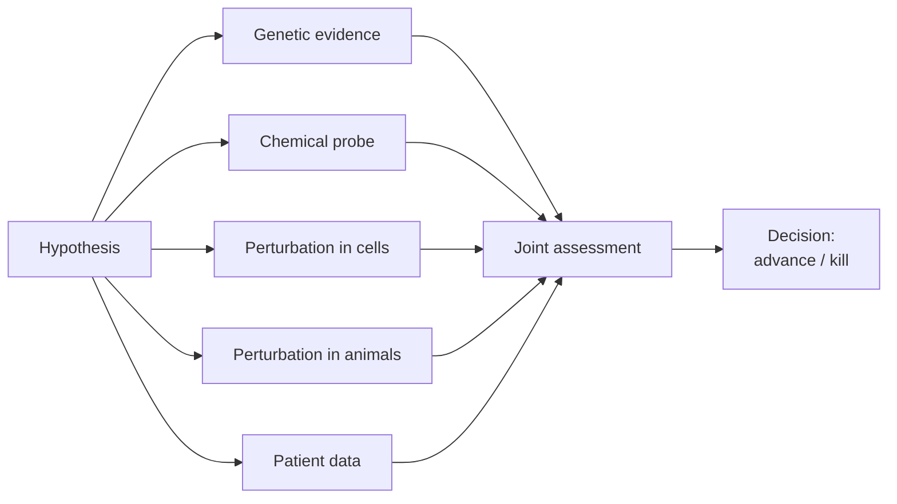

# Target validation

> The wet-lab translation of "this gene matters" into "this protein is the right drug target". The chapter every computationalist should read.

A target is *validated* when independent lines of evidence support that pharmacological modulation of the target will produce the desired clinical effect. The bar is high. Most early "validated" targets fail clinically.

## The validation cascade

A target with 4 / 5 supporting lines is advanced; with 1–2 it is high-risk; with 0 it is a hope.

## 1. Chemical probes

A **chemical probe** is a small molecule that engages the target potently and selectively *in cells*, and produces a phenotypic effect consistent with on-target pharmacology.

- **Criteria** (Frye, Bunnage, Workman et al.): potency < 100 nM at target, > 30× selectivity vs anti-targets, demonstrated cellular target engagement, inactive control compound.
- **Source**: [SGC chemical probes portal](https://www.thesgc.org/chemical-probes) is the curated reference.
- For chemists and computationalists alike, the question is whether a phenotype seen with a probe replicates with a *second* structurally distinct probe. If yes — strong; if no — possibly an off-target effect.

## 2. Genetic perturbation in cells

CRISPR-Cas9 knock-out and knock-in. siRNA knock-down. Degron tags for inducible degradation.

- **Knock-out** mimics chronic complete inhibition.
- **Knock-down (siRNA)** mimics partial inhibition; more relevant to pharmacology but messier.
- **Degron** (AID, dTAG): temporally controlled depletion; the closest in-cell analogue to a clean drug action.

Phenotypic readouts: proliferation, apoptosis, cytokine secretion, target-pathway biomarkers.

## 3. Animal perturbation

Knock-out mice are the workhorse. Conditional alleles (Cre-lox) allow tissue- and time-specific deletion. Patient-derived xenografts (PDX) capture tumour heterogeneity in oncology.

The translational caveats:

- Mouse phenotypes do not always map to human disease (TNF biology differs; IL-17 is similar; KRAS oncogenesis is qualitatively similar but quantitatively different).
- A target with a clean knock-out phenotype is not automatically a clean *pharmacological* target — chronic complete inhibition is harder to achieve and more dangerous than chronic partial.

## 4. Patient data

The gold standard is: a tool compound or biologic was tested in patients and moved a relevant biomarker.

- Often you do not have this until far into a programme. Earlier surrogates:
  - **Biopsies** showing target presence and pathway activity in disease tissue.
  - **Population-level genetic data** (covered under [Genomics](genomics.md)).
  - **Naturally occurring polymorphisms** that mimic pharmacological inhibition (PCSK9 LoF carriers, again).

## 5. Computational triangulation

For each candidate target, you should be able to answer:

| Evidence | Strength |
| --- | --- |
| Genetics (LoF, GWAS) | strong / weak / none |
| Bulk + sc transcriptomics | concordant / discordant / silent |
| Proteomics | present / absent |
| Pathway membership | clear / unclear |
| Cellular perturbation | causal / non-causal / not done |
| Animal perturbation | translatable / non-translatable / not done |
| Tractability | high / medium / low / unknown |

A 7-line row per target is the minimum viable validation summary. A program advancing a target without this is operating on hope.

## Common failure modes

- **The genetic association points at the wrong gene.** Coloc / fine-mapping wasn't done; the nearest gene is not causal.
- **The mouse phenotype is artefactual.** Genetic background, compensation by paralogs, or the knockout is embryonic-lethal so phenotypes you see are developmental, not adult.
- **The probe is not a probe.** Off-target effects swamp the on-target phenotype.
- **The expression isn't in the right cell type.** Single-cell data shows target is in stromal, not tumour, cells.
- **The therapeutic window doesn't exist.** Chronic complete inhibition is intolerable.

Programs that survive validation typically have addressed *all* of these explicitly.

## In practice

- **Validation is iterative**, not a one-time gate. New data emerges through hit-to-lead and beyond.
- **Be sceptical of "validation" claims from a single line of evidence**, especially if that line is a single paper or a single mouse model.
- **Document evidence per target in a structured form** — a Google Doc per target ages badly; a versioned JSON-or-DB row per target lasts.

## Where to next

[Druggability](druggability.md) — the structural / modality side: can a drug actually engage this target?
